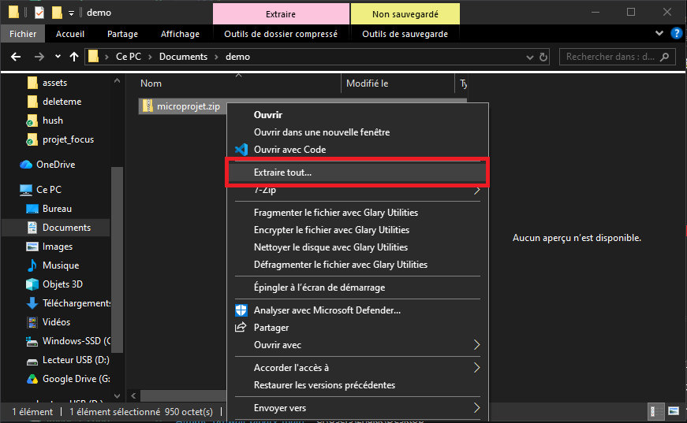

# Introduction

In this tutorial, we will guide you step by step through creating a simple augmented reality (AR) web application.

https://github.com/user-attachments/assets/f4b1f979-b22c-443c-ae03-740b0111a7f0

The goal is to understand the complete technical pipeline that allows a project to run on a web page. We will also see how to write data onto RFID chips.

We will use:

- **A-Frame**: an open-source web framework for creating VR/AR experiences.
- **AR.js**: a JavaScript library to add AR features to web apps.

Our objective is to display the text "Hello" over a barcode-type AR marker, and then customize the content.

This small project also includes making a physical "tag" / "keychain".

<div align="center">
  
  
</div>

We will use several free tools:

- **GitHub**: to version your code and host your project for free.
- **Visual Studio Code / Firebase Studio**: a code editor to write and manage your project.
- **NFC Tools**: a free app for Android/iOS to write information to the RFID sticker.

---

# Prerequisites

- A GitHub account
- A Gmail account
- A computer
- A code editor: [Visual Studio Code](https://code.visualstudio.com/) (or [Firebase Studio](https://studio.firebase.google.com))
- A web browser (Chrome, Firefox, etc.)
- A smartphone with a web browser (Chrome, Firefox, etc.)

---

# Materials Provided

- A small square of wood cardboard with rounded corners
- A precision-cut matte vinyl sticker
- A small metal cord with a screw clasp
- A small RFID chip

<div align="center"> 
  
</div>

### Assembly is very simple:

1. Stick the vinyl marker inside the engraved outline on the front of the wood square.
2. Stick the RFID chip centered on the back of the square.
3. Unscrew the metal cord and thread it through the hole.

And that's it! You are ready for the digital part.

If you want more details on physical fabrication:

- [Vinyl Sticker Cutting Guide](https://github.com/LucieMrc/SilhouetteCameo_2spi)
- [Laser Cutting Guide](https://github.com/b2renger/Introduction_Laser_Beambox)

📽️ **Speedrun video:**

- This tutorial looks long...
- In reality, it takes less than 10 minutes!

https://github.com/user-attachments/assets/0d7ed300-bff6-4171-a3a7-28d8e4be6978

---

# Step 1: Create a GitHub Account and Repository

1. **Create a GitHub account**: If you don't have one, go to https://github.com/signup and create an account.

> ☢️ **The username you choose will be part of the URL to access your site. <u>Choose a short username without spaces or special characters!</u>**

<div align="center"> 
  
  
</div>

2. **Create a new repository**:
   - Once logged in, click the **"New"** (or "New repository") button.
   - Name your repository (e.g., `microProjetAr`).
   - (Optional) Add a description.
   - **Check** the box **"Add a README file"**.
   - Click **"Create repository"**.

<div align="center"> 

</div>
<br/>
<div align="center"> 

</div>

---

# Step 2: Enable GitHub Pages

We will now configure GitHub Pages so GitHub can host and serve our project online at:
`https://[your-username].github.io/[your-repo-name]`

1. In your repository, click **"Settings"**, then select **"Pages"** on the left menu.

<div align="center"> 

</div>
<br/>
<div align="center"> 

</div>

2. Under "Build and deployment" > "Branch", select the **"main"** branch.
3. Click **"Save"**.

<div align="center"> 

</div>

After a few minutes, when you return to the repository home page or Pages settings, your deployment URL will be live!

<div align="center"> 

</div>

The infrastructure is ready; now we just need to add our code.

---

# Step 3: Set Up Visual Studio Code

1. Download and install [Visual Studio Code](https://code.visualstudio.com/).
2. Once opened, you should see this:

<div align="center"> 

</div>

3. Download your repository from GitHub:

<div align="center"> 

</div>

4. Unzip the downloaded file. It will create a folder with your repository's name.

<div align="center"> 

</div>

5. Open it in VS Code via **File > Open Folder**.
   - Make sure you open the actual project folder (not an empty wrapper folder).

<div align="center"> 

</div>

<div align="center"> 

</div>

> [!TIP]
> Keep your project files in a dedicated workspace folder rather than your desktop or Downloads folder.

<div align="center"> 

</div>

> [!CAUTION]
> If your folder tree looks like the image above, the project is incorrectly nested. Make sure you open the root project folder directly.

6. **Install Live Server Extension**:
   - Open the Extensions tab on the left sidebar (or press `Ctrl + Shift + X`).
   - Search for **"Live Server"** and click **Install**.

<div align="center"> 

</div>

<div align="center"> 

</div>

---

# Step 4: Create the Web Page

1. In VS Code, create a new file named **`index.html`**.

<div align="center"> 

</div>

2. Paste the following HTML code into `index.html`:

```html
<!DOCTYPE html>
<html>
  <head>
    <title>My First AR App</title>
    <script src="https://aframe.io/releases/1.6.0/aframe.min.js"></script>
    <script src="https://raw.githack.com/AR-js-org/AR.js/master/aframe/build/aframe-ar.js"></script>
  </head>

  <body>
    <a-scene
      embedded
      arjs="sourceType: webcam; detectionMode: mono_and_matrix; matrixCodeType: 3x3; trackingMethod: best; changeMatrixMode: modelViewMatrix;"
      renderer="sortObjects: true; antialias: true; colorManagement: true; logarithmicDepthBuffer: true;"
      vr-mode-ui="enabled: false"
      smooth="true"
      smoothCount="5"
      smoothTolerance=".05"
      smoothThreshold="5"
      sourceWidth="800"
      sourceHeight="600"
      displayWidth="1280"
      displayHeight="720"
    >
      <a-marker type="barcode" value="0">
        <a-text
          value="Hello !"
          side="double"
          position="0 0 -1"
          rotation="270 0 0"
          width="8"
          color="red"
          align="center"
        >
        </a-text>
      </a-marker>

      <a-entity camera></a-entity>
    </a-scene>
  </body>
</html>
```

---

# Step 5: Understanding the Code

This code creates a basic AR experience using A-Frame and AR.js.

<details>
<summary><b>💡 HTML Basics (Click to expand)</b></summary>

An HTML page is structured like a sandwich:

- `<html>` and `</html>` are the top and bottom slices of bread.
- `<head>` contains background settings, page title, and external scripts/libraries.
- `<body>` contains the visible content shown in the browser.

Tags usually come in pairs: opening (e.g., `<p>`) and closing (e.g., `</p>`).

```html
<html>
  <head>
    <title>My Web Page</title>
  </head>
  <body>
    <h1>Welcome!</h1>
    <p>This is a paragraph of text.</p>
  </body>
</html>
```

</details>
<br/>

### Breakdown of AR Components:

- **A-Frame & AR.js Libraries**:

  ```html
  <script src="https://aframe.io/releases/1.6.0/aframe.min.js"></script>
  <script src="https://raw.githack.com/AR-js-org/AR.js/master/aframe/build/aframe-ar.js"></script>
  ```

  These load the 3D and AR capabilities directly into the browser.

- **The AR Scene (`<a-scene>`)**:
  Initializes the AR canvas and connects to the device webcam.

- **The Marker (`<a-marker>`)**:

  ```html
  <a-marker type="barcode" value="0"></a-marker>
  ```

  Tells AR.js to track a specific 3x3 barcode marker with ID `0`. When the camera sees this marker, anything nested inside this tag becomes visible.

- **The Text Element (`<a-text>`)**:

  ```html
  <a-text
    value="Hello !"
    side="double"
    position="0 0 -1"
    rotation="270 0 0"
    width="8"
    color="red"
    align="center"
  ></a-text>
  ```

  - `value`: The text displayed.
  - `side="double"`: Makes the text visible from both the front and back.
  - `position`: Coordinates `(X Y Z)` relative to the marker center.
  - `rotation`: Orientation in degrees (`270 0 0` lays the text flat over the marker).
  - `color`: Text color.

- **The Camera (`<a-entity camera>`)**:
  Defines the viewpoint.

---

# Step 6: Test on Your Computer

1. Save your `index.html` file (`Ctrl + S` or `Cmd + S`).
2. Open the Command Palette (`Ctrl + Shift + P` / `Cmd + Shift + P`).
3. Type `Live Server` and select **"Live Server: Open with Live Server"**.

<div align="center"> 

</div>

Your default web browser will open automatically with your local site.

---

# Step 7: Test Locally on Your Phone via Dev Tunnels

Your local site runs on `http://127.0.0.1:5500/index.html`. Since `127.0.0.1` represents your local machine, your phone cannot access it directly without exposing the port over the internet.

We will use VS Code's built-in **Port Forwarding (Dev Tunnels)**:

1. In VS Code, click the **Accounts / Settings** icon in the bottom-left corner and select **"Turn on Port Forwarding..."** (or open the Ports tab next to the Terminal).

<div align="center"> 

</div>

2. Sign in with your GitHub account when prompted.

<div align="center"> 


</div>

3. Press `Esc` to close the notification if needed.

<div align="center"> 

</div>

4. Open the Command Palette (`Ctrl + Shift + P`), type **"Forward a Port"**, and press Enter.

<div align="center"> 

</div>

5. Enter the Live Server port number: `5500`.

<div align="center"> 


</div>

6. Grant access permissions when prompted.

<div align="center"> 

</div>

7. Open the generated forwarded address (it will look like a `devtunnels.ms` URL).

<div align="center"> 


</div>

8. Open this `devtunnels.ms` link on your phone (you will need to log in with the same GitHub account once).
9. Point your phone camera at your barcode marker!

<div align="center"> 

</div>

---

# Step 8: Publish to GitHub Pages

Once your app works locally:

1. Go to your GitHub repository in your browser.
2. Click **Add file > Upload files**.

<div align="center"> 

</div>

3. Drag and drop your project files (`index.html` and the `assets` folder if you have one).

<div align="center"> 


</div>

4. Click **"Commit changes"**.

Your live app will be available worldwide at:
`https://[your-username].github.io/[your-repo-name]`

---

# Step 9: Program the RFID Sticker

We will use the free **NFC Tools** app ([Android](https://play.google.com/store/apps/details?id=com.wakdev.wdnfc) / [iOS](https://apps.apple.com/app/nfc-tools/id1252962749)) so tapping the phone to the tag immediately opens your GitHub Pages site.

1. Open **NFC Tools** and tap **"Write"**.
2. Tap **"Add a record"**.
<div align="center"> 
  
</div>

3. Select **"URL / URI"**.
<div align="center"> 
  
</div>

4. Paste your public GitHub Pages URL and validate.
<div align="center"> 
  
</div>

5. Tap **"Write / [Size] Bytes"**.
<div align="center"> 
  
</div>

6. Hold the back of your phone close to your RFID tag until confirmed.
<div align="center"> 
  
  
</div>

---

# Going Further: Custom Assets

A sample asset bundle (image, 3D model, video) is available [here](https://github.com/b2renger/microprojetar/releases/download/v1.1/assets.zip).

### Recommended File Formats

- **Images**: PNG or JPEG (max 1920x1080px, kept small).
- **3D Models**: `.glb` (glTF binary, exported from Blender).
- **Videos**: `.mp4` encoded with H.264 video and AAC audio.
- Keep all asset files under 5 MB for fast web loading.

### Folder Structure

Create an `assets/` folder in your project root and place your media files inside (avoid spaces, accents, and special characters in file names).

<div align="center">
  
  
  
</div>

---

## Code Templates

### 1. Displaying an Image

```html
<!DOCTYPE html>
<html>
  <head>
    <title>AR Image</title>
    <script src="https://aframe.io/releases/1.6.0/aframe.min.js"></script>
    <script src="https://raw.githack.com/AR-js-org/AR.js/master/aframe/build/aframe-ar.js"></script>
  </head>
  <body>
    <a-scene
      embedded
      arjs="sourceType: webcam; detectionMode: mono_and_matrix; matrixCodeType: 3x3; trackingMethod: best; changeMatrixMode: modelViewMatrix;"
      renderer="sortObjects: true; antialias: true; colorManagement: true; logarithmicDepthBuffer: true;"
      vr-mode-ui="enabled: false"
      smooth="true"
      smoothCount="5"
      smoothTolerance=".05"
      smoothThreshold="5"
    >
      <a-assets>
        
      </a-assets>

      <a-marker type="barcode" value="0">
        <a-image
          src="#myImage"
          rotation="270 0 0"
          width="1"
          height="2"
        ></a-image>
      </a-marker>

      <a-entity camera></a-entity>
    </a-scene>
  </body>
</html>
```

---

### 2. Displaying a 3D Model (.glb)

```html
<!DOCTYPE html>
<html>
  <head>
    <title>AR 3D Model</title>
    <script src="https://aframe.io/releases/1.6.0/aframe.min.js"></script>
    <script src="https://raw.githack.com/AR-js-org/AR.js/master/aframe/build/aframe-ar.js"></script>
  </head>
  <body>
    <a-scene
      embedded
      arjs="sourceType: webcam; detectionMode: mono_and_matrix; matrixCodeType: 3x3; trackingMethod: best; changeMatrixMode: modelViewMatrix;"
      renderer="sortObjects: true; antialias: true; colorManagement: true; logarithmicDepthBuffer: true;"
      vr-mode-ui="enabled: false"
      smooth="true"
      smoothCount="5"
      smoothTolerance=".05"
      smoothThreshold="5"
    >
      <a-assets>
        <a-asset-item
          id="myModel"
          src="./assets/plant_modelling.glb"
        ></a-asset-item>
      </a-assets>

      <a-marker type="barcode" value="0">
        <a-entity scale="0.1 0.1 0.1" gltf-model="#myModel"></a-entity>
      </a-marker>

      <a-entity camera></a-entity>
    </a-scene>
  </body>
</html>
```

---

### 3. Displaying a Video (with Optional Green Screen / Chroma Key)

```html
<!DOCTYPE html>
<html>
  <head>
    <title>AR Video</title>
    <script src="https://aframe.io/releases/1.6.0/aframe.min.js"></script>
    <script src="https://raw.githack.com/AR-js-org/AR.js/master/aframe/build/aframe-ar.js"></script>
    <script defer>
      // Chroma key shader definition
      AFRAME.registerShader("chromakey", {
        schema: {
          src: { type: "map" },
          color: {
            default: { x: 0.0, y: 1.0, z: 0.0 },
            type: "vec3",
            is: "uniform",
          },
          chroma: { type: "bool", is: "uniform" },
          transparent: { default: true, is: "uniform" },
        },
        init: function (data) {
          const videoEl = data.src;
          document.addEventListener("click", () => {
            videoEl.play();
          });
          const videoTexture = new THREE.VideoTexture(data.src);
          videoTexture.minFilter = THREE.LinearFilter;
          this.material = new THREE.ShaderMaterial({
            uniforms: {
              chroma: { type: "b", value: data.chroma },
              color: { type: "c", value: data.color },
              myTexture: { type: "t", value: videoTexture },
            },
            vertexShader: `
              varying vec2 vUv;
              void main(void) {
                vUv = uv;
                vec4 mvPosition = modelViewMatrix * vec4(position, 1.0);
                gl_Position = projectionMatrix * mvPosition;
              }
            `,
            fragmentShader: `
              uniform sampler2D myTexture;
              uniform vec3 color;
              uniform bool chroma;
              varying vec2 vUv;
              void main(void) {
                vec3 tColor = texture2D(myTexture, vUv).rgb;
                float a = (chroma) ? (length(tColor - color) - 0.5) * 7.0 : 1.0;
                gl_FragColor = vec4(tColor, a);
              }
            `,
          });
        },
        update: function (data) {
          this.material.color = data.color;
          this.material.src = data.src;
          this.material.transparent = data.transparent;
        },
      });

      // Video playback controller
      AFRAME.registerComponent("vidhandler", {
        init: function () {
          this.trackedElements = document.querySelectorAll(
            "a-marker[vidhandler]",
          );
        },
        tick: function () {
          this.trackedElements.forEach((marker) => {
            const vid = document.querySelector(
              marker.attributes.vidreference.value,
            );
            if (marker.object3D.visible) {
              if (vid && vid.paused) vid.play();
            }
          });
        },
      });
    </script>
  </head>

  <body>
    <a-scene
      embedded
      arjs="sourceType: webcam; detectionMode: mono_and_matrix; matrixCodeType: 3x3; trackingMethod: best; changeMatrixMode: modelViewMatrix;"
      renderer="sortObjects: true; antialias: true; colorManagement: true; logarithmicDepthBuffer: true;"
      vr-mode-ui="enabled: false"
      smooth="true"
      smoothCount="5"
      smoothTolerance=".05"
      smoothThreshold="5"
    >
      <a-assets>
        <video
          id="vid"
          src="assets/video.mp4"
          loop="true"
          preload="auto"
          muted="true"
          playsinline
          webkit-playsinline
        ></video>
      </a-assets>

      <a-marker vidhandler vidreference="#vid" type="barcode" value="0">
        <a-entity
          material="shader: chromakey; src: #vid; chroma: false; color: 0. 0. 0."
          geometry="primitive: plane; width: 1.05; height: 1.05"
          position="0 0 0"
          rotation="270 0 0"
          side="double"
        >
        </a-entity>
      </a-marker>

      <a-entity camera></a-entity>
    </a-scene>
  </body>
</html>
```
