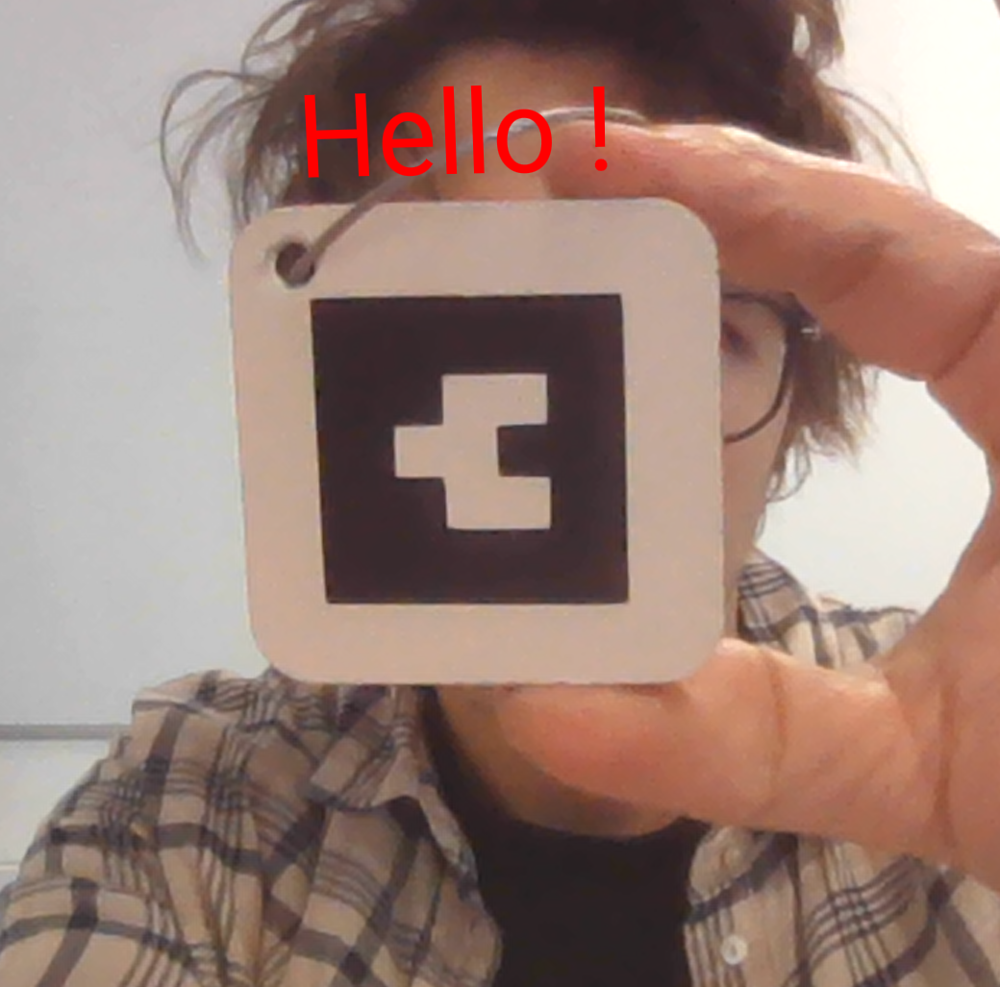
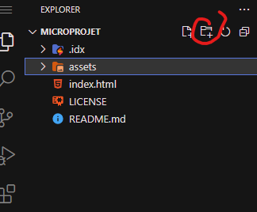

🇫🇷 [French translation](README.md)

# Introduction
In this tutorial, we will guide you step by step through creating a simple augmented reality (AR) web application.

https://github.com/user-attachments/assets/f4b1f979-b22c-443c-ae03-740b0111a7f0

The goal is to see together the entire technical chain that allows a project to exist as a web page. We will also see how to write information on RFID chips.

We will use A-Frame, an open-source web framework for creating VR/AR experiences, and AR.js, a JavaScript library that allows integrating AR functionality into web applications.

Our objective will be to display the text "Hello" on a barcode-type AR marker. Then customize the content.

This small project also includes creating a "tag" / "keychain".
<div align="center">
  
  
</div>

We will use different free tools:
- github: to version your code and host your project for free.
- Firebase Studio: which is an IDE (integrated development environment) that allows writing code and connects to github to hierarchize changes in our code.
- nfctools: which is an application for android or iOS that will allow us to write information on our RFID sticker.

# Prerequisites

- have a Github account
- have a Gmail account

- A computer
- A code editor our tool will be: [Firebase Studio](https://studio.firebase.google.com)
- A web browser (Chrome, Firefox ...)
- A smartphone with a web browser (Chrome, Firefox ...)


# Materials at your disposal
- a small square of wood cardboard with rounded edges
- a sticker cut on matte vinyl
- a small metal cord with a clip
- a small RFID chip

<div align="center"> 
  
</div>


For assembly, nothing could be simpler:
- stick the sticker on the wooden cardboard square in the location delimited by the engraving.
- stick the RFID chip, centered, on the back of this square.
- unscrew the clip and pass it through the hole.

and there you go! we are ready to move on to the digital part!

If you want more information on this part:
- [Sticker cutting explanations](https://github.com/LucieMrc/SilhouetteCameo_2spi)
- [Laser cutting explanations](https://github.com/b2renger/Introduction_Laser_Beambox)


📽️Speedrun video: 
- this tutorial seems long...
- actually no, it takes less than 10 minutes!
  
https://github.com/user-attachments/assets/0d7ed300-bff6-4171-a3a7-28d8e4be6978 


# Step 1: Create a GitHub account and repository
- Create a GitHub account: If you don't already have one, go to https://github.com/signup?source=login and create an account.

**☢️ The username you choose will be used for the address you need to type to see your project. <u>Choose a short name! without spaces, without special characters (accents, cedilla, etc.)</u>**

<div align="center"> 
  
  
</div>

- Create a new repository: Once logged in, click the "New repository" button.
- Give your repository a name (for example, "microProjetAr"),
- (Add an optional description),
- **Enable** the Add README option.
- and click "Create repository".

<div align="center"> 

</div>
</br>
<div align="center"> 

</div>


# Step 2: Enable GitHub Pages
We will now configure GitHub Pages, to allow our project to be served by github servers when we enter the address:

 https://*[your-username]*.github.io/*[your-repo]*


- Access settings: In your repository, click on the "Settings" tab, then on the "Pages" tab

<div align="center"> 

</div>
</br>
<div align="center"> 

</div>

- Select the branch: In the "GitHub Pages" section, select the "main" branch (or the main branch of your repository).
- Save changes: Click the "Save" button. Your GitHub Pages site will now be accessible at https://[your-username].github.io/[microprojetAr].

<div align="center"> 

</div>

If you return to your project's home page, you will notice after a few minutes that some elements have changed. A deployment is now available!

<div align="center"> 

</div>

All the infrastructure needed to host your project is therefore in place, now you just need to add content.


# Step 3: Use Firebase Studio

Go to [Firebase Studio](https://studio.firebase.google.com) and log in.

<blockquote id="parental">
<details>
<summary>Parental control problem? Or age restriction?</summary>


And from this one, you have to go back (but it's important to visit this page)


</details>
</blockquote>

Import the repository: Use the option to import your GitHub repository.

<div align="center"> 

</div>

Copy the address of the repository created previously.
<div align="center"> 


</div>

Configure the project for web development use.

- Create a ".idx" folder:
  <div align="center"> 
  
  </div>

- In this folder, create a file named "dev.nix"
  <div align="center"> 
  
  </div>
  To achieve this result:
   <div align="center"> 
  
  </div>

- Copy the development environment configuration code into the "dev.nix" file you just created. (This file will allow us to test our code directly in Firebase Studio and also test on our phone).

  ```nix
    # To learn more about how to use Nix to configure your environment
  # see: https://developers.google.com/idx/guides/customize-idx-env
  { pkgs, ... }: {
    # Which nixpkgs channel to use.
    channel = "stable-23.11"; # or "unstable"
    # Use https://search.nixos.org/packages to find packages
    packages = [
      pkgs.nodejs_20
      pkgs.python3
    ];
    # Sets environment variables in the workspace
    env = {};
    idx = {
      # Search for the extensions you want on https://open-vsx.org/ and use   "publisher.id"
      extensions = [
        # "vscodevim.vim"
      ];
      # Enable previews and customize configuration
      previews = {
        enable = true;
        previews = {
          web = {
            command = ["python3" "-m" "http.server" "$PORT" "--bind" "0.0.0.0"];
            manager = "web";
          };
        };
      };
      # Workspace lifecycle hooks
      workspace = {
        # Runs when a workspace is first created
        onCreate = {
          # Example: install JS dependencies from NPM
          # npm-install = "npm install";
          # Open editors for the following files by default, if they exist:
          default.openFiles = [ "style.css" "main.js" "index.html" ];
        };
        # Runs when the workspace is (re)started
        onStart = {
          # Example: start a background task to watch and re-build backend code
          # watch-backend = "npm run watch-backend";
        };
      };
    };
  }
  ```

After a few seconds, you should have a preview available.

<div align="center"> 

</div>

But there's nothing in it because we haven't added any content to our index.html. That's the next step!


# Step 4: Create the HTML page

We are going to replace the content of the index.html file (which only contained the word "hello") with code that configures our augmented reality experience.

<div align="center"> 

</div>

Replace the entire content of the file with the code below:

```html
<!doctype html>
<html>

<head>
    <title>My first AR app</title>
    <script src="https://aframe.io/releases/1.6.0/aframe.min.js">

    </script>
    <script src="https://raw.githack.com/AR-js-org/AR.js/master/aframe/build/aframe-ar.js">

    </script>

</head>


<body style="margin : 0px; overflow: hidden;">
    <a-scene embedded
        arjs="sourceType: webcam; detectionMode: mono_and_matrix; matrixCodeType: 3x3; trackingMethod: best ; changeMatrixMode: modelViewMatrix;"
        vr-mode-ui="enabled: false"
        renderer="sortObjects: true; antialias: true; colorManagement: true; physicallyCorrectLights; logarithmicDepthBuffer: true;"
        smooth=" true" smoothCount="5" smoothTolerance=".05" smoothThreshold="5" sourceWidth="800" sourceHeight="600"
        displayWidth="1280" displayHeight="720">


        <a-marker type='barcode' value='0'>
            <a-text value="Hello !" side="double" position="0 0 -1" rotation="270 0 0" width="8" color="red"
                align="center">
            </a-text>
        </a-marker>

        <a-entity camera></a-entity>

    </a-scene>


</body>

</html>
```

Once the code is pasted and the file saved, your preview should refresh automatically. We now have our first augmented reality application!

# Step 5: Understanding the code
This code creates a simple augmented reality (AR) experience using A-Frame and AR.js. Let's break down what each part does:

If you are not comfortable and don't know at all how html code works, click on the small triangle to unfold an explanation of the basics of html syntax

<details > <summary> <b>&#128161 html basics</b> </summary>

An HTML page is like a sandwich. It needs bread on top and bread on bottom to contain the filling!

The top and bottom bread are the ```<html>``` and ```</html>``` tags. They tell the browser that the content between these tags is HTML code.

Two main parts: Inside the "HTML sandwich", we find two parts:

- The head: ```<head> ... </head>``` (this is where we put information about the page, but which is not displayed directly. Like the page title, links to styles or libraries).
- The body: ```<body> ... </body>``` (this is where we put the content that will be displayed on the page).

Tags work in pairs (most of the time): A tag is opened with ```<tag>``` and closed with ```</tag>```. What is between the two is the content of this tag.

For example:
- ```<body>``` opens the body of the page and ```</body>``` closes it.
- ```<h1>``` opens a level 1 title and ```</h1>``` closes it.
- ```<p>``` opens a paragraph and ```</p>``` closes it.

</details>
</br>

Here we have a classic HTML structure: The code sets up a basic HTML page with the <head> and <body> sections.


In the ```<head>``` part, we add:

- the title of the experience
  ```html
  <title>My first AR app</title>
  ```

- the *A-Frame Library*: It includes the A-Frame library (aframe.min.js) which is a JavaScript framework for creating virtual reality (VR) and AR experiences using HTML.
  ```html
  <script src="https://aframe.io/releases/1.6.0/aframe.min.js"></script>
  ```

- the *AR.js Library*: It also includes the AR.js library (aframe-ar.js) which adds AR capabilities to A-Frame.
  ```html
  <script src="https://raw.githack.com/AR-js-org/AR.js/master/aframe/build/aframe-ar.js"></script>
  ```

In the ```<body>``` part we create our 3D AR scene:

- *a-scene*: This is the main container for the AR scene.
  ```html
  <a-scene embedded arjs="..." renderer="..." vr-mode-ui="enabled: false" ...>
  ```

  Notice that in the opening ```<a-scene>``` tag we add many options (called attributes in html) to configure how the scene will display.

  <details > <summary> <b>&#128161 details of the arjs attribute configuration options</b> </summary>
  - *embedded* : This attribute tells A-Frame to embed the scene in the HTML page.

  - *arjs* : This attribute configures AR.js
    - *sourceType: webcam* : Uses the device's webcam as video source.
    - *detectionMode: mono_and_matrix* : Detects both target images and barcode type markers.
    - *matrixCodeType: 3x3* : Specifies that the barcode type used is a 3x3 matrix barcode.
    - *trackingMethod: best* : Uses the best tracking method available.

  - *renderer* : This attribute configures how the 3D scene is rendered 
    - *sortObjects: true* : Sorts 3D objects by depth for better rendering.
    - *antialias: true* : Enables antialiasing to smooth the edges of 3D objects.
    - *colorManagement: true* : Enables color management for better colors.
    - *logarithmicDepthBuffer: true* : Uses a logarithmic depth buffer for better depth precision.

  - *vr-mode-ui="enabled: false"* : Disables the VR mode button interface.

  - *smooth, smoothCount, smoothTolerance, smoothThreshold* : Configuration options to smooth marker tracking and reduce jitter.

  - *sourceWidth, sourceHeight, displayWidth, displayHeight* : Configuration options for video source and display resolution.

  </details>
  </br>

- *a-marker*: This defines a marker (in this case a barcode marker with value '0') that the AR system will look for.
  ```html
  <a-marker type='barcode' value='0'>
  ```

- *a-text*: This is the 3D text that will appear on the marker when detected.
  ```html
  <a-text value="Hello !" side="double" position="0 0 -1" rotation="270 0 0" width="8" color="red" align="center">
  ```

  The different parameters/attributes control the appearance and position of the text:
  - *value="Hello !"* : The text to display.
  - *side="double"* : Makes the text visible from both sides.
  - *position="0 0 -1"* : 3D position of the text (x, y, z).
  - *rotation="270 0 0"* : Rotation of the text in degrees (x, y, z).
  - *width="8"* : Size of the text.
  - *color="red"* : Color of the text.
  - *align="center"* : Text alignment.

- *a-entity camera*: This represents the camera/viewpoint of the user.
  ```html
  <a-entity camera></a-entity>
  ```

When you run this code in a web browser on a device with a camera, it will:
1. Access the device's camera
2. Analyze the video stream to look for barcode markers
3. When it detects a marker with value '0', it will display the red "Hello !" text above the marker
4. The text will follow the marker as you move it around

This creates a simple but functional AR experience where digital content (the text) is overlaid on the real world (via the camera) and anchored to physical markers.

# Step 6: Testing

That's it! Our application is functional.

Now we need to test our application.


- Save changes: Save your index.html file.

- Test your project: Display the web preview of your project.

To open your app's preview, search for "web" in the palette to find "Show Web Preview". (Reminder: the palette is `Ctrl/Cmd + Shift + P`).

<div align="center"> 
  
</div>

You can then view your page in full screen mode by clicking on the small icon in the top right-hand corner.

<div align="center"> 
  
</div>

This will open your experience in a new tab on your computer. At this point you should see: a web page showing you!

If you show the marker to the camera you should see this:

<div align="center"> 
  
</div>

Your project now works in the editor and with your computer's camera.

Now you can test it on your smartphone. Simply go to the page you've just opened.

To do this, click on the "link" icon in the top right-hand corner to open in a new window. Scan the qr code and the page will be loaded onto your phone.

<div align="center"> 
  
</div>

  
You can then repeat these operations, changing the code, saving and refreshing the page. 

For example, try changing the text, its color, size, position etc.

# Step 7: Publish the application

Committing changes: Use Firebase Studio's versioning tools to commit your changes and push them to your GitHub repository.

- Click on the Firebase Studio source control button
  <div align="center"> 
  
  </div>

- Storing changes by clicking on the "+" button
  <div align="center"> 
  
  </div>

- Add a message explaining the changes** !
! this is mandatory!
- Commit' the changes by clicking on the 'commit' button
  <div align="center"> 
  
  </div>

- Synchronize changes by clicking on the 'commit' button
  <div align="center"> 
  
  </div>

<div align="center"> 
  
  
  
  
  
  
  
</div>

This last operation will send your changes to your github repository and update the page.

**Your experiment is now deployed at:** *https://[your-user-name].github.io/[your-depot]*

**✨ Congratulations! ✨** You've created your first AR application. Now you can customize your app by modifying the text, adding 3D models, and experimenting with different A-Frame and AR.js features.

Note: This tutorial is a basic introduction. To deepen your knowledge, please consult the official A-Frame and AR.js documentation.


 # Step 8: Encode the RFID sticker

Our goal is to program our RFID sticker so that when we approach our phone, it will offer to open the web page hosting our project.

To do this, we're going to use NFCTools, which is free and available for [Android](https://play.google.com/store/apps/details?id=com.wakdev.wdnfc&hl=fr) or [iOS](https://apps.apple.com/fr/app/nfc-tools/id1252962749)?

- Choose the "Write" tab and select "Add a record".
  <div align="center"> 
  
  </div>
- Select "URL/URI
  <div align="center"> 
  
  </div>
- Enter the address of your page then validate
  <div align="center"> 
  
  </div>
- You can now click on the "Write" button below the "More options" field.
  <div align="center"> 
  
  </div>
- You should see this screen asking you to move your smartphone closer to the sticker.
  <div align="center"> 
  
  </div>
- Once you've successfully detected your sticker, you should be able to write it.
  <div align="center"> 
  
  </div>

It should be OK!
You can close NFCTools and test!


# To go further ...

An entire course in English is available on [the ateliernum website](http://ateliernum.github.io) at this address: https://github.com/b2renger/Introduction_A-frame#introduction_a-frame

Customize appearance: Add more elements, change colors, sizes and positions of elements.

Add 3D models: Import 3D models into your scene.

Use other marker types: Explore the different types of AR markers.

Create interactions: Add events and interactions to your application.

But if you've got here fast, you deserve a little help with templates for adding an image, 3D model or video.

## Upload assets

You can download a zip with: an image, a 3D model and a video [at this address](https://github.com/b2renger/microprojetar/releases/download/v1.1/assets.zip).


### Asset formats

Assets are files that can be used in your application, such as images, 3D models, sounds and videos.

In a web context, these files need to be light enough to load quickly, and optimized.
- images and videos should have a maximum resolution of 1920x1080 pixels 
  - videos encoded in H.264 and mp4 format
  - images in png or jpeg format.

- 3D models should be in glb format (the web format), exportable from blender.

Your files must be no larger than 5mo (although for an image this is already enormous).

You can find an asset pack at this address:
https://github.com/b2renger/microprojetar/releases/download/v1.1/assets.zip


### Adding files to firebase

It's good practice to put our assets files in a separate folder. 

So we're going to create an 'assets' folder in firebase. It's the same as when we created a folder for our configuration file.
<div align="center"> 
  
</div>

You can then move files into this new folder - avoid using accents, spaces and special characters in file names.

<div align="center"> 
  
</div>

If you have imported all the assets in the zip file, it should look like this

<div align="center"> 
  
</div>

Now it's time to load the files into our A-Frame scene.

### Loading them into our scene

Each file type has a different loading mode. This is done between the <a-scene> ... and </a-scene> tags.

Please note that we need to adapt these new elements to our file names

- In the "src" parameter, we load the file named "file_name.png" which is stored in the asset folder.
- In the id parameter we choose an alias that will allow us to refer to this file without having to retype its name.

For images :
We load the file logo_ecole_1_coul_defonce_noir.png which is stored in the asset folder.

```html
<a-assets>
  
</a-assets> 

```

For 3D models :
We load the plant_modelling.glb file, which is stored in the asset folder.
```html
<a-assets>
  <a-asset-item id="glbTest" src="./assets/plant_modelling.glb"></a-asset-item>
</a-assets>

```

For videos :
We load the video file stored in the asset folder.
```html
 <a-assets>
      <!--point to you *mp4 file : h264, AAC etc-->
      <video src="./assets/video.mp4" muted="true" loop="true" controls="false" playsinline webkit-playsinline
        type='video/mp4' id="vid"></video>
</a-assets>
```


## Code examples
The examples below are complete and functional, so you can copy and paste them directly into your index.html file.

### Images
You'll need to adjust the "width" and "height" of the image according to the aspect ratio of your image so that it doesn't become distorted.

```html
<!DOCTYPE html>
<html>

<head>
  <title>Ma première app AR</title>
  <script src="https://aframe.io/releases/1.6.0/aframe.min.js"></script>
  <script src="https://raw.githack.com/AR-js-org/AR.js/master/aframe/build/aframe-ar.js"></script>
</head>

<body>
  <a-scene embedded
    arjs="sourceType: webcam; detectionMode: mono_and_matrix; matrixCodeType: 3x3; trackingMethod: best ; changeMatrixMode: modelViewMatrix;"
    renderer="sortObjects: true; antialias: true; colorManagement: true; logarithmicDepthBuffer: true;"
    vr-mode-ui="enabled: false" smooth=" true" smoothCount="5" smoothTolerance=".05" smoothThreshold="5"
    sourceWidth="800" sourceHeight="600" displayWidth="1280" displayHeight="720">

    <a-assets>
      
    </a-assets>


    <a-marker type='barcode' value='0'>
      <a-image src="#img1" rotation="270 0 0" width="1" height="2"></a-image>
    </a-marker>

    <a-entity camera></a-entity>
  </a-scene>
</body>

</html>
```

### 3D
Remember to adapt the scale parameter to your model's export units.

```html
<!DOCTYPE html>
<html>

<head>
  <title>Ma première app AR</title>
  <script src="https://aframe.io/releases/1.6.0/aframe.min.js"></script>
  <script src="https://raw.githack.com/AR-js-org/AR.js/master/aframe/build/aframe-ar.js"></script>
</head>

<body>
  <a-scene embedded
    arjs="sourceType: webcam; detectionMode: mono_and_matrix; matrixCodeType: 3x3; trackingMethod: best ; changeMatrixMode: modelViewMatrix;"
    renderer="sortObjects: true; antialias: true; colorManagement: true; logarithmicDepthBuffer: true;"
    vr-mode-ui="enabled: false" smooth=" true" smoothCount="5" smoothTolerance=".05" smoothThreshold="5"
    sourceWidth="800" sourceHeight="600" displayWidth="1280" displayHeight="720">

    <a-assets>
      <a-asset-item id="model" src="./assets/plant_modelling.glb"></a-asset-item>
    </a-assets>


    <a-marker type='barcode' value='0'>
  
        <a-entity scale=".1 .1 .1" gltf-model="#model"></a-entity>
      
    </a-marker>

    <a-entity camera></a-entity>
  </a-scene>
</body>

</html>
``` 

### Vidéo (le plus compliqué)
In this very complex example, we add a javascript script to the head of the page.

This script manages the automatic playback of the video when the marker is detected. However, it doesn't work every time (we're talking about Safari and iOS here...).

It also allows you to create a chromakey, i.e. to make a color transparent (a green background, for example ;))

In short, there's a lot of code to start with!

Just remember to change file names and ids to match your files.


<div align="center"> 
  
</div>

You'll also need to think about the ratio aspect, as with images, using the element's 'width' and 'height' parameters.

```html
<!DOCTYPE html>
<html>

<head>
  <title>Ma première app AR</title>
  <script src="https://aframe.io/releases/1.6.0/aframe.min.js"></script>
  <script src="https://raw.githack.com/AR-js-org/AR.js/master/aframe/build/aframe-ar.js"></script>
  <script defer>
    // https://github.com/nikolaiwarner/aframe-chromakey-material
    AFRAME.registerShader("chromakey", {
      schema: {
        src: { type: "map" },
        color: {
          default: { x: 0.0, y: 1.0, z: 0.0 },
          type: "vec3",
          is: "uniform",
        },
        chroma: { type: "bool", is: "uniform" },
        transparent: { default: true, is: "uniform" },
      },

      init: function (data) {
        const videoEl = data.src;
        document.addEventListener("click", () => {
          videoEl.play();
          const entity = document.querySelector("[sound]");
          // console.log(entity)
          // console.log(document.querySelector("#debug-marker"))
          entity.components.sound.playSound();
        });

        var videoTexture = new THREE.VideoTexture(data.src);
        videoTexture.minFilter = THREE.LinearFilter;
        this.material = new THREE.ShaderMaterial({
          uniforms: {
            chroma: {
              type: "b",
              value: data.chroma,
            },
            color: {
              type: "c",
              value: data.color,
            },
            myTexture: {
              type: "t",
              value: videoTexture,
            },
          },
          vertexShader: `
            varying vec2 vUv;

            void main(void)
            {
              vUv = uv;
              vec4 mvPosition = modelViewMatrix * vec4( position, 1.0 );
              gl_Position = projectionMatrix * mvPosition;
            }
          `,
          fragmentShader: `
              uniform sampler2D myTexture;
              uniform vec3 color;
              uniform bool chroma;
              varying vec2 vUv;

              void main(void)
              {
                vec3 tColor = texture2D( myTexture, vUv ).rgb;
                float a;
                if(chroma == true){
                   a = (length(tColor - color) - 0.5) * 7.0;
                }
                else {
                  a = 1.0;
                }

                gl_FragColor = vec4(tColor, a);
              }
            `,
        });
      },

      update: function (data) {
        this.material.color = data.color;
        this.material.src = data.src;
        this.material.transparent = data.transparent;
      },
    });

    AFRAME.registerComponent("vidhandler", {
      trackedElements: null,

      init: function () {
        this.trackedElements = document.querySelectorAll(
          "a-marker[vidhandler]"
        );
       // console.log(this.trackedElements);
      },
      tick: function () {
        // if(!userConsent){
        //   return;
        // }

        this.trackedElements.forEach((marker) => {
          if (marker.object3D.visible) {
            const vid = document.querySelector(
              marker.attributes.vidreference.value
            );
           // console.log(vid)        
            if (vid.paused) {
              vid.play();
            }
          } else {
            const vid = document.querySelector(
              marker.attributes.vidreference.value
            );
          }
        });
      },
    });
  </script>

</head>

<body>
  <a-scene embedded
    arjs="sourceType: webcam; detectionMode: mono_and_matrix; matrixCodeType: 3x3; trackingMethod: best ; changeMatrixMode: modelViewMatrix;"
    renderer="sortObjects: true; antialias: true; colorManagement: true; logarithmicDepthBuffer: true;"
    vr-mode-ui="enabled: false" smooth=" true" smoothCount="5" smoothTolerance=".05" smoothThreshold="5"
    sourceWidth="800" sourceHeight="600" displayWidth="1280" displayHeight="720">

    <a-assets>
      <video id="vid" src="assets/video.mp4" autoplay="true" loop="true" preload="auto" controls="true"
      muted="true" playsinline="" webkit-playsinline=""></video>
    </a-assets>

    <a-marker vidhandler vidreference="#vid" type="barcode" value="0">
      <a-entity material="shader: chromakey; src: #vid; chroma:false; color: 0. 0. 0."
        geometry="primitive: plane; width:  1.05; height:  1.05" position="0  0  0" rotation="270  0  0" side="double">
      </a-entity>
    </a-marker>

    <a-entity camera></a-entity>
  </a-scene>
</body>

</html>
```
