🇬🇧 [English translation](README-en.md)

# Introduction

Dans ce tutoriel, nous allons vous guider pas à pas dans la création d'une application web en réalité augmentée (AR) simple.

// TODO refaire la video

https://github.com/user-attachments/assets/f4b1f979-b22c-443c-ae03-740b0111a7f0

L'objectif est de voir ensemble toute la chaine technique qui permet à un projet d'exister en tant que page web. Nous verrons aussi comment écrire des informations sur des puces RFID.

Nous utiliserons la version web de "8th Wall", un framework anciennement proprietaire, pour créer des expériences AR.

Notre objectif sera d'afficher le texte "Hello" sur une image nous servant de point d'ancrage AR. Puis de customiser le contenu.

Ce petit projet comprend aussi la réalisation d'une "étiquette" / "porte clé".

<div align="center">
  
  
</div>

Nous allons utiliser différents outils gratuits :

- GitHub : pour versionner votre code et hébérger gratuitement votre projet.
- Visual Studio Code(VSCode) : qui est un IDE (Integrated Development Environment) qui permet d'écrire du code et qui se connecte à GitHub pour hierarchiser les changements dans notre code.
- nfctools : qui est une application pour android ou iOS et qui nous permettra d'écrire de l'information sur notre sticker RFID.

# Prérequis

- Avoir un compte Github

- Un ordinateur
- Un éditeur de code notre outil sera : [Visual Studio Code](https://code.visualstudio.com/)
- Un navigateur web (Chrome, Firefox ...)
- Un smartphone avec un navigateur web (Chrome, Firefox ...)

# Matériel à votre disposition

- un petit carré de carton bois aux bords arrondis
- un sticker découpé sur vinyle mat
  // TODO on leur file quoi? un truc taille carte postale pour coller leur image sortie de l'imprimante?
- un petit cordon métallique avec une attache
- une petite puce RFID

<div align="center"> 
  
</div>

Pour l'assemblage, rien de plus simple :

- coller l'image sur le carré en carton bois sur l'emplacement délimité
- coller la puce RFID, centrée, au dos de ce carré.
- dévisser l'attache et faite la passer dans le trou.

et voilà ! on est prêts à passer sur la partie numérique !

Si vous voulez plus d'infos sur cette partie là

- [Explications sur la découpe laser](https://github.com/b2renger/Introduction_Laser_Beambox)

📽️Speedrun video :

- ce tuto parait long ...
- en vrai non, ça prend moins de 10 minutes !

// TODO refaire la video

https://github.com/user-attachments/assets/0d7ed300-bff6-4171-a3a7-28d8e4be6978

# Étape 1 : Créer un compte GitHub et un dépôt

- Créer un compte GitHub : Si vous n'en avez pas déjà un, rendez-vous sur https://github.com/signup?source=login et créez un compte.

> [!WARNING]
> Le nom d'utilisateur que vous choisissez sera utilisé pour l'adresse qu'il faudra tapper pour voir votre projet. <u>Choisissez un nom court ! sans espaces, sans caractères spéciaux (accents, cédille, etc.)</u>

<div align="center"> 
  
  
</div>

- Créer un nouveau dépôt : Une fois connecté, cliquez sur le bouton "New repository".
- Donnez un nom à votre dépôt (par exemple, "microProjetAr"),
- (Ajoutez une description facultative),
- **Activer** l'option Add README.
- et cliquez sur "Create repository".

<div align="center"> 

</div>
</br>
<div align="center"> 

</div>

# Étape 2 : Activer GitHub Pages

Nous allons maintenant configurer GitHub Pages, pour permettre à notre projet d'être servi par les serveurs de github lorsque l'on rentre l'adresse :

https://_[votre-nom-utilisateur]_.github.io/_[votre-depot]_

- Accéder aux paramètres : Dans votre dépôt, cliquez sur l'onglet "Settings", puis sur l'onglet "Pages"

<div align="center"> 

</div>
</br>
<div align="center"> 

</div>

- Sélectionner la branche : Dans la section "GitHub Pages", sélectionnez la branche "main" (ou la branche principale de votre dépôt).
- Enregistrer les modifications : Cliquez sur le bouton "Save". Votre site GitHub Pages sera maintenant accessible à l'adresse https://[votre-nom-utilisateur].github.io/[microprojetAr].

<div align="center"> 

</div>

Si vous revenez sur la page d'accueil de votre projet...

<div align="center"> 
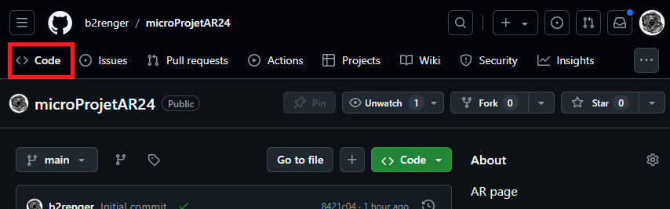
</div>

... vous remarquerez au bout de quelques minutes, que certains éléments ont changés. Un déploiement est maintenant disponible !

<div align="center"> 

</div>

Toute l'infrastructure nécessaire pour héberger votre projet est donc bien en place, il suffit maintenant d'ajouter du contenu.

# Étape 3 : Utiliser Visual Studio Code

Rendez-vous sur [Visual Studio Code](https://code.visualstudio.com/), telechargez, et installez le.

Une fois ouvert vous devriez voir ceci


On va recuperer une copie du projet que vous venez de creer sur github en le "clonant".

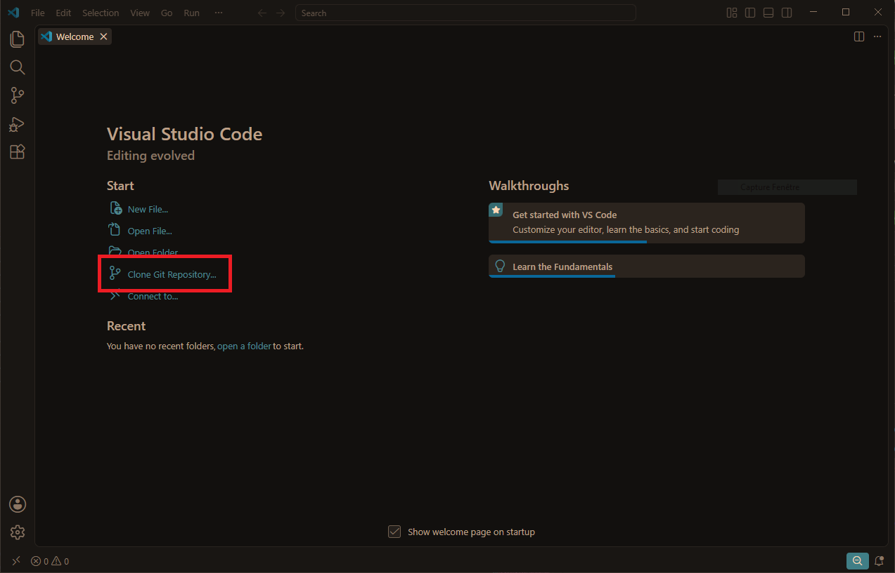
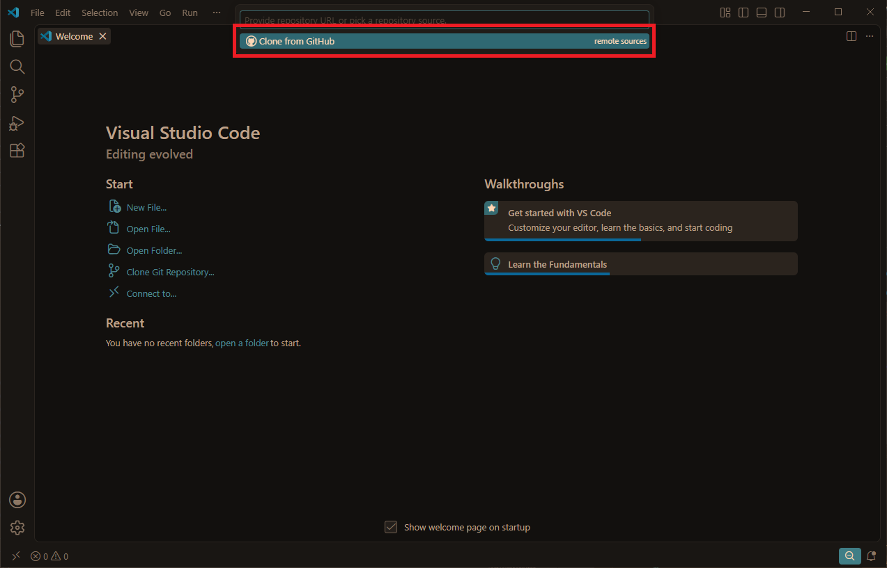

Cependant votre VSCode n'est pas connecte a votre compte github et n'as donc pas les permissions et il va donc vous demander de regler ca

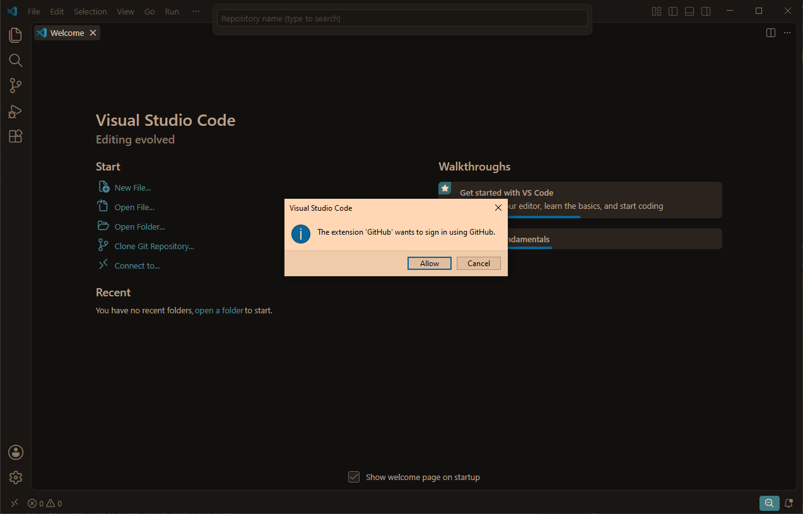
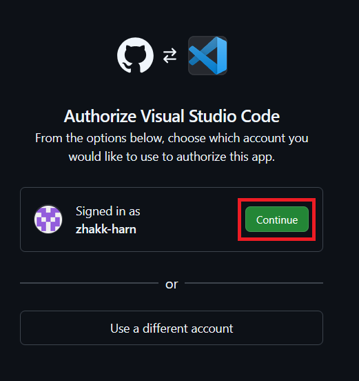

Une fois chose faites, selectionnez votre projet, il est possible de taper dans la barre pour les filtrer.

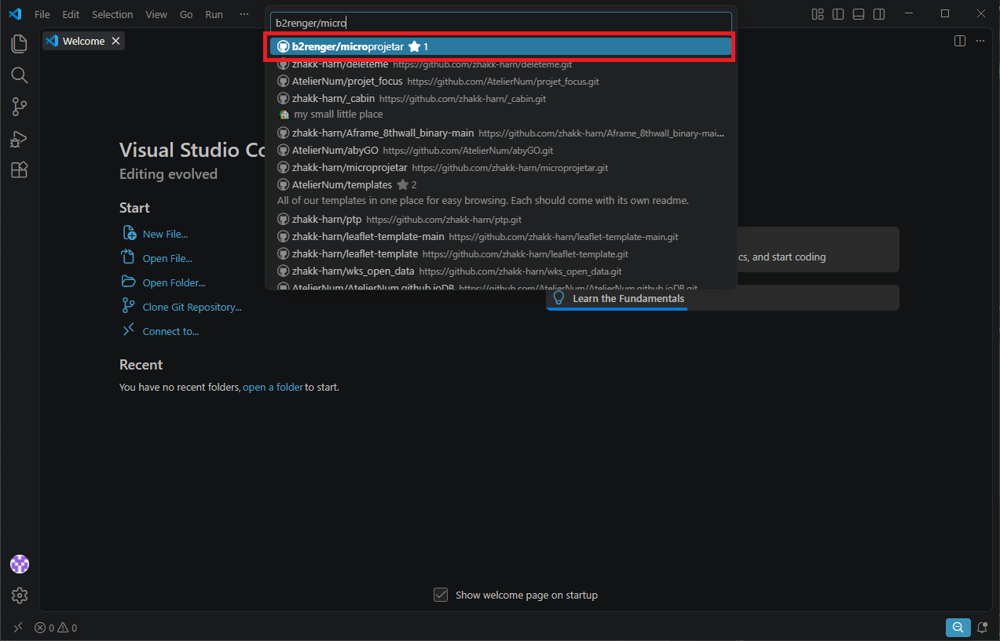

Vous allez devoir choisir ou enregistrer cette copie du projet sur votre ordinateur.

> [!TIP]
> Il est vivement recommande de ranger votre projet plutot que de le mettre sur le bureau ou dans le dossier telechargement.

Acceptez d'ouvrir le projet dans VSCode, apes tout c'est pour ca qu'on vient de le telecharger.

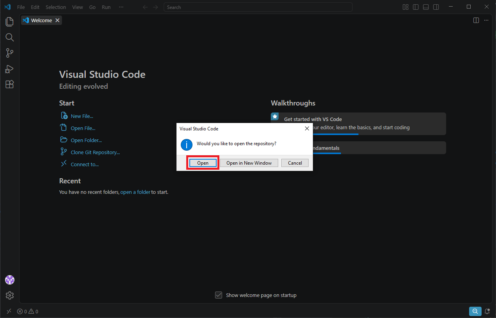

Maintenant vous devriez avoir une copie du projet dans vos dossiers et ouvert dans VSCode.

Cependant pour etre prets a travailler il nous manque une extension, donc allons dans le menu des extensions pour chercher "Live Server"

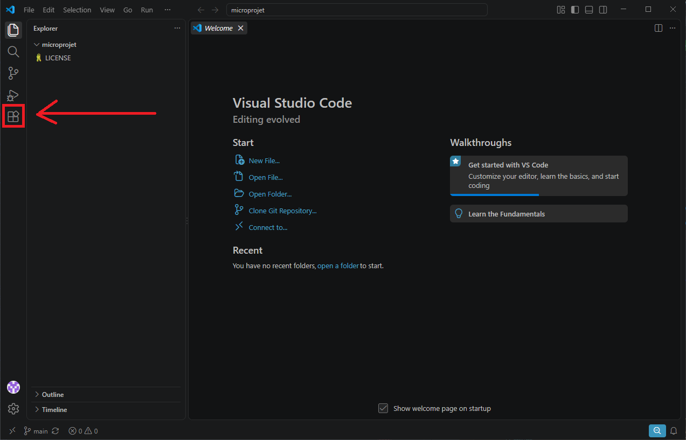

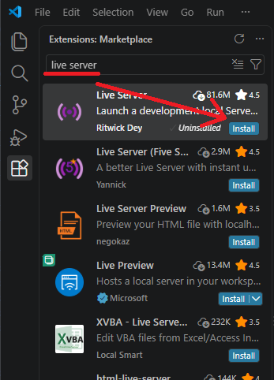

Et voila! On peut maintenant faire du web, l'environement dans lequel on va se servir de 8th Wall.

On va dans un premier temps se faire une page web simple sans AR pour tester que tout marche comme il faut.

Dans votre projet, creez un fichier `index.html`

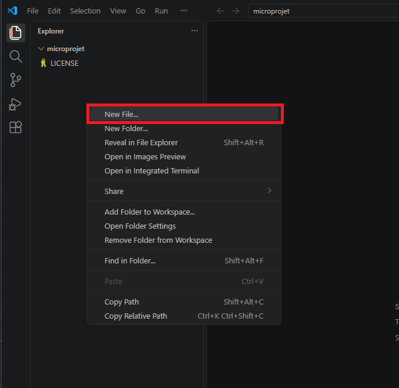

Et collez ce code dedans

```html
<!DOCTYPE html>
<html lang="fr">
  <head>
    <meta charset="UTF-8" />
    <meta name="viewport" content="width=device-width, initial-scale=1.0" />
    <meta name="color-scheme" content="dark light" />
    <title>Ma première appli AR</title>
    <style>
      body {
        margin: 0;
        font-family: system-ui, sans-serif;
      }

      h1,
      h2,
      h3 {
        font-family:
          "Iowan Old Style", "Palatino Linotype", "URW Palladio L", P052, serif;
      }

      main {
        height: 100svh;
        display: grid;
        place-items: center;

        hgroup {
          border: 1px solid gray;
          padding: 1rem 2rem;
          border-radius: 0.5rem;
        }
      }
    </style>
  </head>
  <body>
    <main>
      <hgroup>
        <h1>Ça c'est ma page web</h1>
        <p>
          Y en a beaucoup comme ça, mais elle c'est la mienne. Ma page web c'est
          mon amie.
        </p>
      </hgroup>
    </main>
  </body>
</html>
```

Puis demarrez l'extension live server :

1. Ouvrez la palette avec `Ctrl + Shift + P`
2. Saisissez `Live` pour ne voir que les options liees a Live Server
3. Choississez `Live Server : Open with Live Server`

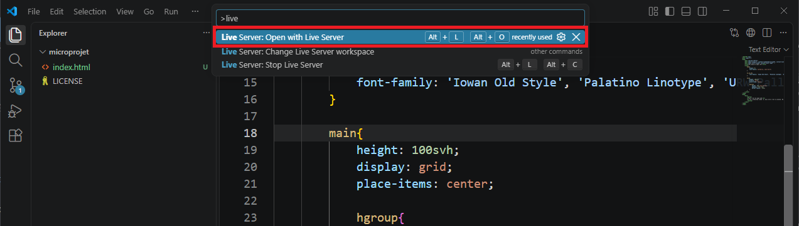

Votre site va automatiquement s'ouvrir dans votre navigateur web par defaut

# Étape Optionnelle : Comprendre le web

Si vous n'êtes pas à l'aise et ne connaissez pas du tout la manière dont du code html fonctionne cliquez sur le petit triangle pour déplier une explication des bases de la syntaxe html

<details > <summary> <b>&#128161 les bases html</b> </summary>

Une page HTML est comme un sandwich. Elle a besoin d'un pain du haut et d'un pain du bas pour contenir la garniture !

Le pain du haut et du bas, ce sont les balises `<html>` et `</html>`. Elles indiquent au navigateur que le contenu entre ces balises est du code HTML.

Deux parties principales : À l'intérieur du "sandwich HTML", on trouve deux parties :

**La tête** (`<head>` et `</head>`) : C'est comme les informations sur l'emballage du sandwich. On y met des informations importantes pour le navigateur, mais qui ne sont pas affichées directement à l'utilisateur.

Par exemple :

- Le titre de la page `<title>` qui décrit au navigateur quoi afficher dans la barre d'onglets.

- Des liens vers des fichiers CSS pour charger la mise en page

- Des liens vers des fichiers JavaScript pour les fonctionnalités interactives

**Le corps** (`<body>` et `</body>`) : C'est la garniture du sandwich ! C'est le contenu visible de la page web : texte, images, vidéos, etc.

La syntaxe et donc l'interprétation par le navigateur du code html repose sur des balises ouvrantes et fermantes :

- La balise **ouvrante** (par exemple `<p>`) dit au navigateur : "Attention, on commence un paragraphe !"
- La balise fermante (par exemple `</p>`) dit : "Voilà, le paragraphe est terminé."

Tout le contenu entre la balise ouvrante et la balise fermante est considéré comme faisant partie de cet élément.

Exemple :

```html
<html>
  <head>
    <title>Ma page web</title>
  </head>
  <body>
    <h1>Bienvenue !</h1>
    <p>Ceci est un paragraphe de texte.</p>
  </body>
</html>
```

Dans cet exemple :

- `<html>` ouvre la page HTML et `</html>` la ferme.
- `<head>` ouvre la section d'en-tête et `</head>` la ferme.
- `<title>` ouvre le titre de la page et `</title>` le ferme.
- `<body>` ouvre le corps de la page et `</body>` le ferme.
- `<h1>` ouvre un titre de niveau 1 et `</h1>` le ferme.
- `<p>` ouvre un paragraphe et `</p>` le ferme.

</details>
</br>

# Étape 4 : Tester son site depuis son telephone

Vous pourrez constater (sauf si vous etes sur Safari) que l'adresse de votre page est `http://127.0.0.1:5500/index.html`

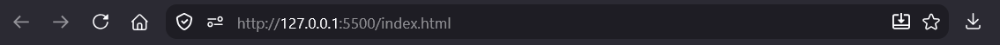

Quand vous visitez un lien, votre navigteur va demander une page web a l'adresse renseignee

<details> <summary> c'est marque `http://` et pas `https://` c'est quoi la difference?</summary>

Le `S` veux dire "Secure".

La difference est que dans une demande http, toutes les machines, qui vont faire passer la demande jusqu'au serveur de destintation, peuvent lire votre message. Tandis qu'avec https uniquement vous et le serveur en bout de chaine comprennent les messages que vous vous echangez.

C'est ca qui vous protege, et pas les VPNs qui vous gavent de pub.

</details>

`127.0.0.1` est une adresse speciale parce qu'elle veux dire "moi meme". Autrement dit, sur mon ordinateur `127.0.0.1` est mon ordinateur, mais sur votre ordinateur `127.0.0.1` est le votre.

En l'etat, votre site n'est pas accessible depuis internet, donc il n'est pas _facilement_ accessible depuis votre telephone, or on va avoir besoin de la camera et des capteur de mouvement de votre telephone pour l'AR.

Donc on va utiliser un service gracieusement fournit par microsoft qui possede github et VSCode, et va "forward un port", ce qui veux dire qu'on va demnander a microsoft d'etre un relais vers l'exterieur pour une de nos application (Live Serveur dans ce cas).

Cliquez sur l'icone tout dans le coin inferieur gauche et electionnez "Tunnel"


Selectionnez une connexion via votre compte github qui devrait deja etre lie a votre VSCode.


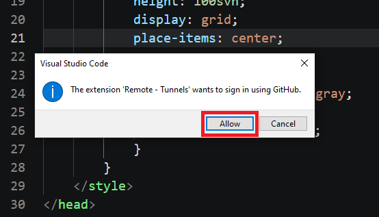

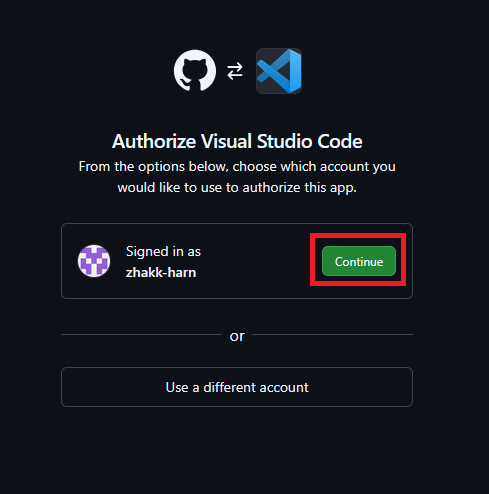

Appuyez sur la touche `Esc` de votre clavier.


Ouvrez la palette `Ctrl + Shift + P` et selectionnez `Forward a Port`

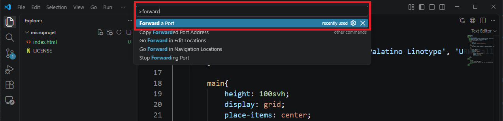

Rentrez le numero du port utilise par Live Server. Dans ce cas il s'agit du port 5500.


Authorisez la redirection de ports au nom du compte que vous venez de connecter

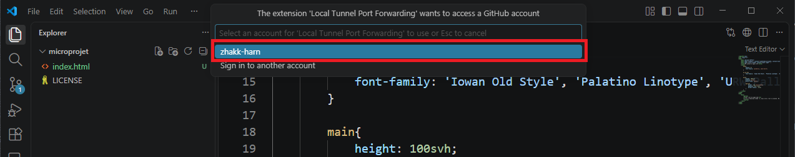

Ouvrez la redirection de votre port.

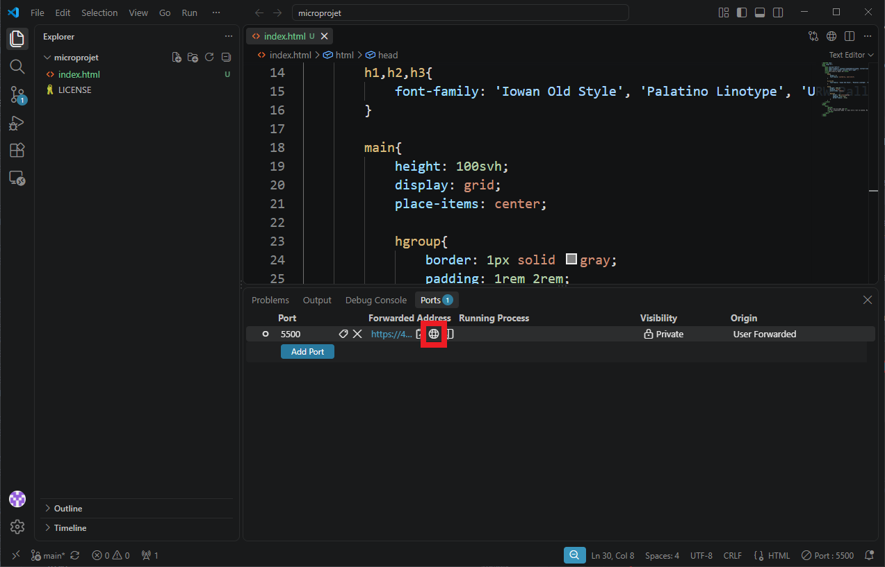


Microsoft va vous informer qu'ils vont vous diriger vers une page en cours de devolppement.

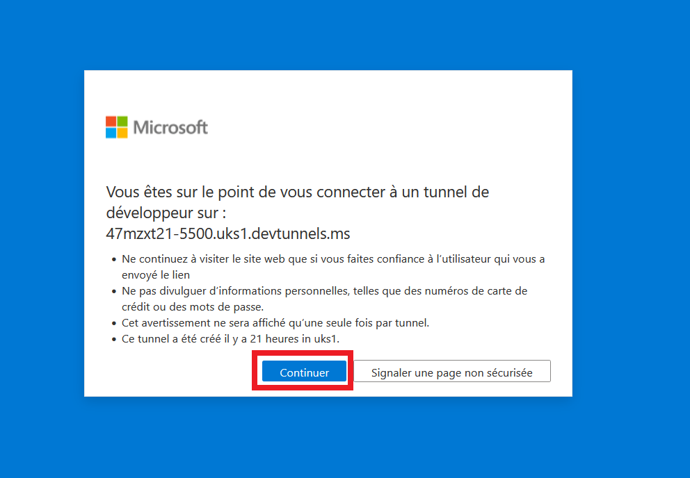

Vous pouvez constater que vous avez acces a votre site web au travers d'une addresse `devtunnels.ms`.

D'ailleurs, si vous changez votre page web dans VSCode et que vous sauvegarder, vous verrez que les changements se font directement dans votre page web, prouvant qu'elle est bien fournie par Live Server. (Il est possible que vous ayez besoin de rafraichir la page une fois pour que la synchronisation Live Server se mette bien en place).

Pour l'ouvrir sur votre telephone vous pouvez coller l'adresse que vous venez d'obtenir dans la barre d'adresse de votre navigateur (Chrome, Firefox...).

// TODO gerer le splash login parcequ'il faut aussi etre connecte a github sur son telephone

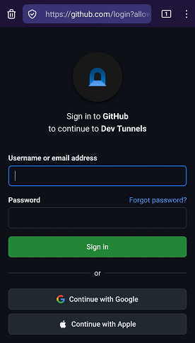

// TODO insert a link to a QR code generator on some CDN

# Étape 4 : Mettre en place la Realite Augmentee

// TODO importer tout les dependances

// on leur fait tout telecharger et on leur fait tout importer en drag and drop depuis leurs telechargements

Ce code créer une expérience simple de réalité augmentée (RA) en utilisant du code web de base et 8th Wall. Décomposons ce que fait chaque partie :

Ici nous avons une structure HTML classique : Le code met en place une page HTML basique avec les sections <head> et <body>.

Dans la partie `<head>`, nous ajoutons :

- le titre de l'expérience

  ```html
  <title>Ma première app AR</title>
  ```

// TODO redo the library import

- la _Bibliothèque A-Frame_ : Il inclut la bibliothèque A-Frame (aframe.min.js) qui est un framework JavaScript permettant de créer des expériences de réalité virtuelle (RV) et de RA en utilisant du HTML.
  Une bibliothèque est simplement du code que l'on ammène dans le projet pour ajouter des fonctionnalités supplémentaires. Un framework est une bibliothèque qui nécessite de respecter certaines regles pour bien marcher, mais en echange un framework est plus puissante qu'une bibliothèque normale.

  ```html
  <script src="https://aframe.io/releases/1.3.0/aframe.min.js"></script>
  ```

- la _Bibliothèque AR.js_ : Il inclut la bibliothèque AR.js (aframe-ar.js) qui ajoute des capacités de RA à A-Frame.
  ```html
  <script src="https://raw.githubusercontent.com/jeromeetienne/AR.js/master/aframe/build/aframe-ar.js"></script>
   
  ```

Dans la partie `<body>`, et c'est ici que tout ce joue pour le contenu visible par l'utilisateur. Nous ajoutons :

- la _scène RA_ : L'élément `<a-scene>` crée la scène de RA.

  ```html
  <a-scene
    embedded
    arjs="sourceType: webcam; detectionMode: mono_and_matrix; matrixCodeType: 3x3; trackingMethod: best ; changeMatrixMode: modelViewMatrix;"
    renderer="sortObjects: true; antialias: true; colorManagement: true; physicallyCorrectLights; logarithmicDepthBuffer: true;"
    vr-mode-ui="enabled: false"
    smooth=" true"
    smoothCount="5"
    smoothTolerance=".05"
    smoothThreshold="5"
    sourceWidth="800"
    sourceHeight="600"
    displayWidth="1280"
    displayHeight="720"
  >
    <!-- contenu de l'expérience AR avec d'autres balises -->
  </a-scene>
  ```

  Remarquez que dans la balise ouvrante `<a-scene>` nous ajoutons beaucoup d'options (qui s'appellent attributs en html) pour configuer la manière dont la scène va s'afficher.

  <details > <summary> <b>&#128161 les détails des options de configuration de l'attribut arjs</b> </summary>
  - *embedded* : Cet attribut indique à A-Frame d'intégrer la scène dans la page HTML.
  - _arjs_ : Cet attribut configure AR.js
    - _sourceType: webcam_ : Utilise la webcam de l'appareil comme source vidéo.
    - _detectionMode: mono_and_matrix_ : Détecte à la fois les images cibles et les marqueurs de type code-barres.
    - _matrixCodeType: 3x3_ : Spécifie que le type de code-barres utilisé est un code-barres matriciel 3x3.
    - _trackingMethod: best_ : Utilise la meilleure méthode de suivi disponible.
    - _changeMatrixMode: modelViewMatrix_ : Mode de changement de matrice pour le suivi.
    - _vr-mode-ui="enabled: false"_ : Désactive l'interface utilisateur du mode VR.
    - _renderer_. Configure le rendu de la scène avec des options pour le tri des objets, l'antialiasing, la gestion des couleurs, etc.
    - _smooth_ : Active le lissage du mouvement de la caméra.
    </details>
    </br>

- Le _marqueur_ : L'élément `<a-marker>` définit un marqueur de type code-barres avec la valeur '2'. Lorsque la caméra détecte ce marqueur, le contenu à l'intérieur de la balise sera affiché en RA.

  ```html
  <a-marker type="barcode" value="0">
    <!-- ajouter du contenu qui sera visible par l'utilisateur et donc ancré sur notre marqueur -->
  </a-marker>
  ```

  Ici la valeur 9 correspond à un motif précis qui a été prédécoupé pour vous à la [découpeuse de stickers](https://github.com/LucieMrc/SilhouetteCameo_2spi). Avec la technique que nous utilisons [il existe 64 motifs différents](https://github.com/b2renger/Introduction_A-frame/blob/main/markers/barcodes/2.png) qui peuvent être détectés en même temps par arjs.

- Un texte : L'élément <a-text> crée un texte en 3D qui sera affiché au-dessus du marqueur. Le texte est "Hello !", de couleur rouge et centré.

  ```html
  <a-text
    value="Hello !"
    side="double"
    position="0 0 -1"
    rotation="270 0 0"
    width="8"
    color="red"
    align="center"
  >
  </a-text>
  ```

    <details > <summary> <b>&#128161 les détails des attributs de la balise a-text</b> </summary>
  - *value* : Le texte à afficher.
  - *side=double* : permet d'afficher le texte quelque soit l'angle sous lequel on le regarde.
  - *position="0 0 -1" : la position xyz du centre du texte par rapport au centre du marqueur.
  - *rotation="270 0 0"* :
  - *width="8"* : la largeur du texte.
  - *color="red"* : la couleur du texte.
  - *align="center"* : l'alignement du texte.
  </details>
  </br>

- Caméra : L'élément `<a-entity camera>` définit la caméra de la scène, le fonctionnement par défaut nous convient parfaitement, mais il est possible d'ajouter des fonctionalités comme par exemple l'interaction via l'orientation du regard ('gaze' interaction).

En résumé, ce code crée une expérience de RA où un texte apparaît dans un esapce 3D lorsque le marqueur code-barres 0 est détecté par la caméra.

# Étape 6 : Publier l'application

Des que vous allez fermer VSCode la redirection de port va se terminer et votre experience AR ne sera plus accessible en ligne. On va donc voir comment mettre a jour la version github de votre projet

Commiter les modifications : Utilisez les outils de versioning integres a VSCode pour commiter vos changements et les pousser sur votre dépôt GitHub.

// TODO c'est essentiellement une question de refaire les screenshots

Cette dernière opération va envoyer vos changements à votre dépot github et du coup mettre à jour la page mise en ligne.

**Votre expérience est maintenant déployée à l'adresse :** _https://[votre-nom-utilisateur].github.io/[votre-depot]_

**✨ Félicitations ! ✨** Vous avez créé votre première application AR. Vous pouvez maintenant personnaliser votre application plus loin en modifiant le texte, en ajoutant des modèles 3D.

# Étape 7 : Encoder le sticker RFID

Notre but est de programmer notre sticker RFID pour que lorsque nous approchons notre téléphone, celui-ci va nous proposer d'ouvrir la page web hébergeant notre projet.

Pour cela nous allons utiliser NFCTools qui est gratuit et qui est disponible pour [Android](https://play.google.com/store/apps/details?id=com.wakdev.wdnfc&hl=fr) ou [iOS](https://apps.apple.com/fr/app/nfc-tools/id1252962749)?.

- Choisir l'onglet "Ecrire" et sélectionner "ajouter un enregistrement"
  <div align="center"> 
  
  </div>
- Choisir "URL/URI"
  <div align="center"> 
  
  </div>
- Entrer l'adresse de votre page puis valider
  <div align="center"> 
  
  </div>
- Vous pouvez maintenant cliquer sur le bouton "Ecrire" sous le champ "Plus d'options"
  <div align="center"> 
  
  </div>
- Vous devrier voir cet écran vous demandant d'approcher votre smartphone du sticker.
  <div align="center"> 
  
  </div>
- Une fois que vous avez réussi à détecter votre sticker, l'écriture devrait s'effectuer
  <div align="center"> 
  
  </div>

Normalement c'est bon !
Vous pouvez fermer NFCTools et tester !

# Pour aller plus loin ...

## Charger des assets

// TODO changer le lien ci-dessous pour une addresse raw.github.com/, jsdelivr, raw.githack.com

Vous pouvez télécharger un zip avec : une image, un modèle 3D et une vidéo [à cette adresse](https://github.com/b2renger/microprojetar/releases/download/v1.1/assets.zip).

### Les formats d'assets

Les assets sont des fichiers qui peuvent être utilisés dans votre application, cela peut-être : des images, des modèles 3D, des sons, des vidéos.

Nous sommes dans un contexte web du coup il faut que ces fichiers soient légers pour ce charger rapidement et de maniere optimisée.

- prévoyez des images et vidéos dans une résolution 1920x1080 pixels maximum
  - pour les vidéos encodés en H.264 et au format mp4
  - pour les images au format png ou jpeg.

- pour les 3D cela sera des modèles 3D au format glb (le format du web), exportable depuis Blender.

Vos fichiers ne doivent pas faire plus de 5Mo (même si pour une image c'est déjà énorme).

### Ajouter des fichiers dans votre projet

// TODO remonter ce chapitre dans le setup
// TODO penser a leur filer les assets a telecharger et rentrer dans leur projet eux meme plutot que de leur filer un zip deja tout setup

C'est une bonne pratique de mettre nos fichiers assets dans un dossier séparé.

Nous allons donc créer un dossier 'assets' dans firebase. C'est la même chose que lorsque nous avons créé un dossier pour notre fichier de configuration.

<div align="center"> 
  
</div>

Vous pouvez ensuite déplacer des fichiers dans ce nouveau dossier - évitez les accents, les espaces et les caractères spéciaux dans les noms de fichiers.

<div align="center"> 
  
</div>

Si vous avez importé tous les assets du fichiers zip, cela devrait ressembler à cela

<div align="center"> 
  
</div>

Maintenant il faut charger les fichiers dans notre scene A-Frame.

### Les charger dans notre scène

// TODO en theorie tout ca n'est qu'une seule etape avec la nouvelle forme des exemples

Chaque type de fichier a mode de chargement différent. Cela se fait entre les balises `<a-scene>` ... et `</a-scene>`

Notez bien qu'il faut adapter ces nouveaux éléments au nom de nos fichiers

- Dans le paramètre "src", nous chargeons le fichier nommé "nom_du_fichier.png" qui est rangé dans le dossier asset.
- Dans le paramètre id nous choisissons un alias qui nous permettra de réferencer ce fichier sans avoir à retapper son nom.

Pour les images :
Nous chargeons le fichier logo_ecole_1_coul_defonce_noir.png qui est rangé dans le dossier asset.

```html
<a-assets>
  
</a-assets>
```

Pour les modèles 3D :
Nous chargeons le fichier plant_modelling.glb qui est rangé dans le dossier asset.

```html
<a-assets>
  <a-asset-item id="glbTest" src="./assets/plant_modelling.glb"></a-asset-item>
</a-assets>
```

Pour les vidéos :
Nous chargeons le fichier video qui est rangé dans le dossier asset.

```html
<a-assets>
  <!--point to you *mp4 file : h264, AAC etc-->
  <video
    src="./assets/video"
    muted="true"
    loop="true"
    controls="false"
    playsinline
    webkit-playsinline
    type="video/mp4"
    id="vid"
  ></video>
</a-assets>
```

## Exemples de code

Les exemples fournis ci-dessous sont complets et fonctionnels, vous pouvez les copier / coller directement dans votre fichier index.html

### Images

Vous aurez besoin d'adapter la largeur "width" et la hauteur "height" de l'image selon l'aspect ratio de votre image pour qu'elle ne soit pas déformée.

```html
<!DOCTYPE html>
<html>
  <head>
    <title>Ma première app AR</title>
    <script src="https://aframe.io/releases/1.6.0/aframe.min.js"></script>
    <script src="https://raw.githack.com/AR-js-org/AR.js/master/aframe/build/aframe-ar.js"></script>
  </head>

  <body>
    <a-scene
      embedded
      arjs="sourceType: webcam; detectionMode: mono_and_matrix; matrixCodeType: 3x3; trackingMethod: best ; changeMatrixMode: modelViewMatrix;"
      renderer="sortObjects: true; antialias: true; colorManagement: true; logarithmicDepthBuffer: true;"
      vr-mode-ui="enabled: false"
      smooth=" true"
      smoothCount="5"
      smoothTolerance=".05"
      smoothThreshold="5"
      sourceWidth="800"
      sourceHeight="600"
      displayWidth="1280"
      displayHeight="720"
    >
      <a-assets>
        
      </a-assets>

      <a-marker type="barcode" value="0">
        <a-image src="#img1" rotation="270 0 0" width="1" height="2"></a-image>
      </a-marker>

      <a-entity camera></a-entity>
    </a-scene>
  </body>
</html>
```

### 3D

Pensez à adapter le paramètre scale en fonction des unités d'export de votre modèle.

```html
<!DOCTYPE html>
<html>
  <head>
    <title>Ma première app AR</title>
    <script src="https://aframe.io/releases/1.6.0/aframe.min.js"></script>
    <script src="https://raw.githack.com/AR-js-org/AR.js/master/aframe/build/aframe-ar.js"></script>
  </head>

  <body>
    <a-scene
      embedded
      arjs="sourceType: webcam; detectionMode: mono_and_matrix; matrixCodeType: 3x3; trackingMethod: best ; changeMatrixMode: modelViewMatrix;"
      renderer="sortObjects: true; antialias: true; colorManagement: true; logarithmicDepthBuffer: true;"
      vr-mode-ui="enabled: false"
      smooth=" true"
      smoothCount="5"
      smoothTolerance=".05"
      smoothThreshold="5"
      sourceWidth="800"
      sourceHeight="600"
      displayWidth="1280"
      displayHeight="720"
    >
      <a-assets>
        <a-asset-item
          id="model"
          src="./assets/plant_modelling.glb"
        ></a-asset-item>
      </a-assets>

      <a-marker type="barcode" value="0">
        <a-entity scale=".1 .1 .1" gltf-model="#model"></a-entity>
      </a-marker>

      <a-entity camera></a-entity>
    </a-scene>
  </body>
</html>
```

### Vidéo (le plus compliqué)

Dans cet exemple très complexe, nous ajoutons un script javascript dans le head de la page.

Ce script permet de gérer la lecture automatique de la vidéo, quand le marqueur est détecté. Malgré cela ne marche pas à tous les coups (on parle bien ici de Safari et iOS...)

Il permet aussi de créer un chromakey, c'est à dire de rendre une couleur transparente (par exemple un fond vert, au hasard ;))

Bref il y a beaucoup de code au début !

Pensez quand même à changer les noms de fichiers et les ids pour qu'il correspondent à vos fichiers.

<div align="center"> 
  
</div>

Il faudra aussi penser à l'aspect ratio comme pour les images avec les paramètres 'width' et 'height' de l'élément.

```html
<!DOCTYPE html>
<html>
  <head>
    <title>Ma première app AR</title>
    <script src="https://aframe.io/releases/1.6.0/aframe.min.js"></script>
    <script src="https://raw.githack.com/AR-js-org/AR.js/master/aframe/build/aframe-ar.js"></script>
    <script defer>
      // https://github.com/nikolaiwarner/aframe-chromakey-material
      AFRAME.registerShader("chromakey", {
        schema: {
          src: { type: "map" },
          color: {
            default: { x: 0.0, y: 1.0, z: 0.0 },
            type: "vec3",
            is: "uniform",
          },
          chroma: { type: "bool", is: "uniform" },
          transparent: { default: true, is: "uniform" },
        },

        init: function (data) {
          const videoEl = data.src;
          document.addEventListener("click", () => {
            videoEl.play();
            const entity = document.querySelector("[sound]");
            // console.log(entity)
            // console.log(document.querySelector("#debug-marker"))
            entity.components.sound.playSound();
          });

          var videoTexture = new THREE.VideoTexture(data.src);
          videoTexture.minFilter = THREE.LinearFilter;
          this.material = new THREE.ShaderMaterial({
            uniforms: {
              chroma: {
                type: "b",
                value: data.chroma,
              },
              color: {
                type: "c",
                value: data.color,
              },
              myTexture: {
                type: "t",
                value: videoTexture,
              },
            },
            vertexShader: `
            varying vec2 vUv;

            void main(void)
            {
              vUv = uv;
              vec4 mvPosition = modelViewMatrix * vec4( position, 1.0 );
              gl_Position = projectionMatrix * mvPosition;
            }
          `,
            fragmentShader: `
              uniform sampler2D myTexture;
              uniform vec3 color;
              uniform bool chroma;
              varying vec2 vUv;

              void main(void)
              {
                vec3 tColor = texture2D( myTexture, vUv ).rgb;
                float a;
                if(chroma == true){
                   a = (length(tColor - color) - 0.5) * 7.0;
                }
                else {
                  a = 1.0;
                }

                gl_FragColor = vec4(tColor, a);
              }
            `,
          });
        },

        update: function (data) {
          this.material.color = data.color;
          this.material.src = data.src;
          this.material.transparent = data.transparent;
        },
      });

      AFRAME.registerComponent("vidhandler", {
        trackedElements: null,

        init: function () {
          this.trackedElements = document.querySelectorAll(
            "a-marker[vidhandler]",
          );
          // console.log(this.trackedElements);
        },
        tick: function () {
          // if(!userConsent){
          //   return;
          // }

          this.trackedElements.forEach((marker) => {
            if (marker.object3D.visible) {
              const vid = document.querySelector(
                marker.attributes.vidreference.value,
              );
              // console.log(vid)
              if (vid.paused) {
                vid.play();
              }
            } else {
              const vid = document.querySelector(
                marker.attributes.vidreference.value,
              );
            }
          });
        },
      });
    </script>
  </head>

  <body>
    <a-scene
      embedded
      arjs="sourceType: webcam; detectionMode: mono_and_matrix; matrixCodeType: 3x3; trackingMethod: best ; changeMatrixMode: modelViewMatrix;"
      renderer="sortObjects: true; antialias: true; colorManagement: true; logarithmicDepthBuffer: true;"
      vr-mode-ui="enabled: false"
      smooth=" true"
      smoothCount="5"
      smoothTolerance=".05"
      smoothThreshold="5"
      sourceWidth="800"
      sourceHeight="600"
      displayWidth="1280"
      displayHeight="720"
    >
      <a-assets>
        <video
          id="vid"
          src="assets/video.mp4"
          autoplay="true"
          loop="true"
          preload="auto"
          controls="true"
          muted="true"
          playsinline=""
          webkit-playsinline=""
        ></video>
      </a-assets>

      <a-marker vidhandler vidreference="#vid" type="barcode" value="0">
        <a-entity
          material="shader: chromakey; src: #vid; chroma:false; color: 0. 0. 0."
          geometry="primitive: plane; width:  1.05; height:  1.05"
          position="0  0  0"
          rotation="270  0  0"
          side="double"
        >
        </a-entity>
      </a-marker>

      <a-entity camera></a-entity>
    </a-scene>
  </body>
</html>
```

// TODO faire une section collapsible pour expliquer comment RE-lancer son projet, et donc faire la distinction entre ce qui est du setup de ce qui est de l'ouverture
// => ou une section tout a la fin qu'on peut link directement avec header id

// TODO section troubleshoot pour mettre des parades a tout les problemes qui seront rencontres plus tard
