🇬🇧 [English translation](README-en.md)

# Introduction

Dans ce tutoriel, nous allons vous guider pas à pas dans la création d'une application web en réalité augmentée (AR) simple.

https://github.com/user-attachments/assets/f4b1f979-b22c-443c-ae03-740b0111a7f0

L'objectif est de voir ensemble toute la chaîne technique qui permet à un projet d'exister en tant que page web. Nous verrons aussi comment écrire des informations sur des puces RFID.

Nous utiliserons A-Frame, un framework web open-source pour créer des expériences VR/AR, et AR.js, une bibliothèque JavaScript qui permet d'intégrer des fonctionnalités AR dans les applications web.

Notre objectif sera d'afficher le texte "Hello" sur un marqueur AR de type code-barres. Puis de customiser le contenu.

Ce petit projet comprend aussi la réalisation d'une "étiquette" / "porte-clé".

<div align="center">
  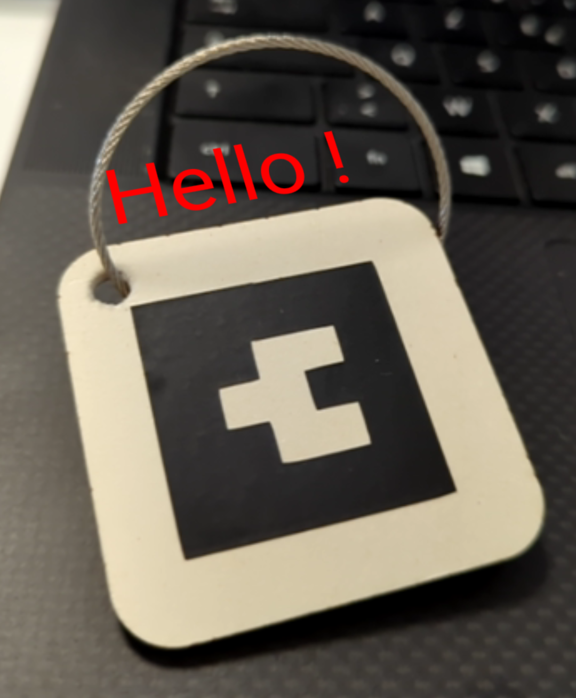
  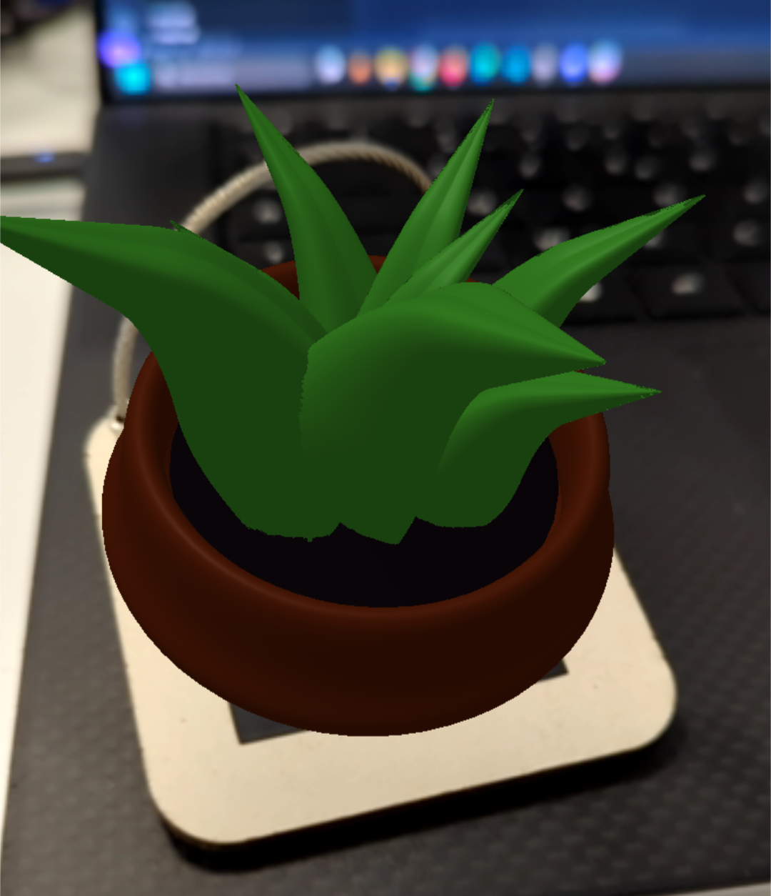
</div>

Nous allons utiliser différents outils gratuits :

- GitHub : pour versionner votre code et héberger gratuitement votre projet.
- Visual Studio Code : qui est un IDE (integrated development environment) qui permet d'écrire du code et qui se connecte à GitHub pour hiérarchiser les changements dans notre code.
- NFC Tools : qui est une application pour Android ou iOS et qui nous permettra d'écrire de l'information sur notre sticker RFID.

# Prérequis

- avoir un compte GitHub
- avoir un compte Gmail

- Un ordinateur
- Un éditeur de code, notre outil sera : [Visual Studio Code](https://code.visualstudio.com/)
- Un navigateur web (Chrome, Firefox...)
- Un smartphone avec un navigateur web (Chrome, Firefox...)

# Matériel à votre disposition

- un petit carré de carton bois aux bords arrondis
- un sticker découpé sur vinyle mat
- un petit cordon métallique avec une attache
- une petite puce RFID

<div align="center"> 
  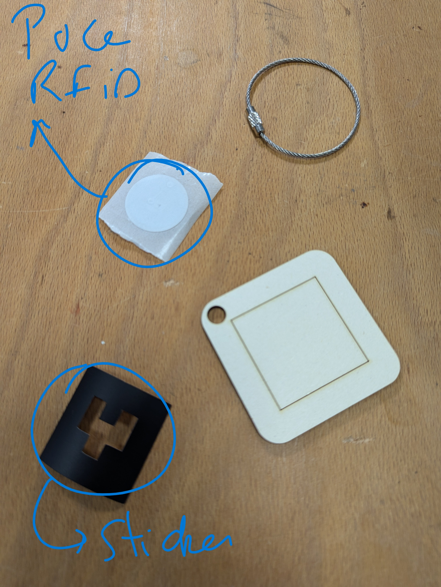
</div>

Pour l'assemblage, rien de plus simple :

- coller le sticker sur le carré en carton bois sur l'emplacement délimité par la gravure.
- coller la puce RFID, centrée, au dos de ce carré.
- dévisser l'attache et faites-la passer dans le trou.

et voilà ! on est prêts à passer sur la partie numérique !

Si vous voulez plus d'infos sur cette partie-là :

- [Explications de la découpe stickers](https://github.com/LucieMrc/SilhouetteCameo_2spi)
- [Explications sur la découpe laser](https://github.com/b2renger/Introduction_Laser_Beambox)

📽️Speedrun video :

- ce tuto paraît long...
- en vrai non, ça prend moins de 10 minutes !

https://github.com/user-attachments/assets/0d7ed300-bff6-4171-a3a7-28d8e4be6978

# Étape 1 : Créer un compte GitHub et un dépôt

- Créer un compte GitHub : Si vous n'en avez pas déjà un, rendez-vous sur https://github.com/signup?source=login et créez un compte.

**☢️ Le nom d'utilisateur que vous choisissez sera utilisé pour l'adresse qu'il faudra taper pour voir votre projet. <u>Choisissez un nom court ! sans espaces, sans caractères spéciaux (accents, cédille, etc.)</u>**

<div align="center"> 
  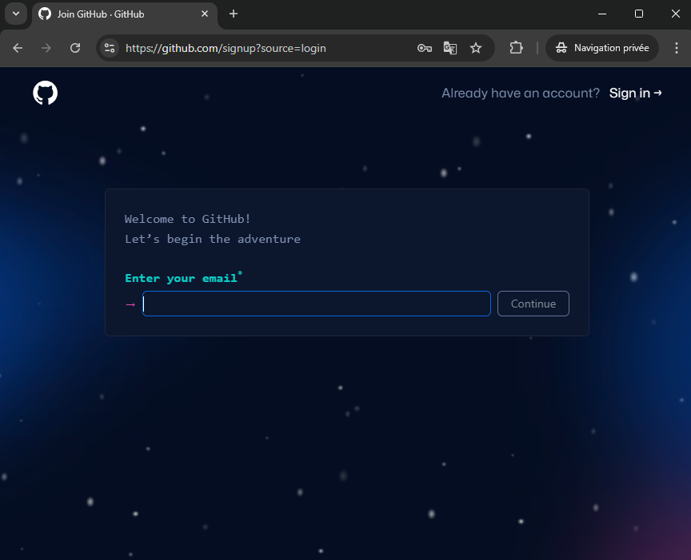
  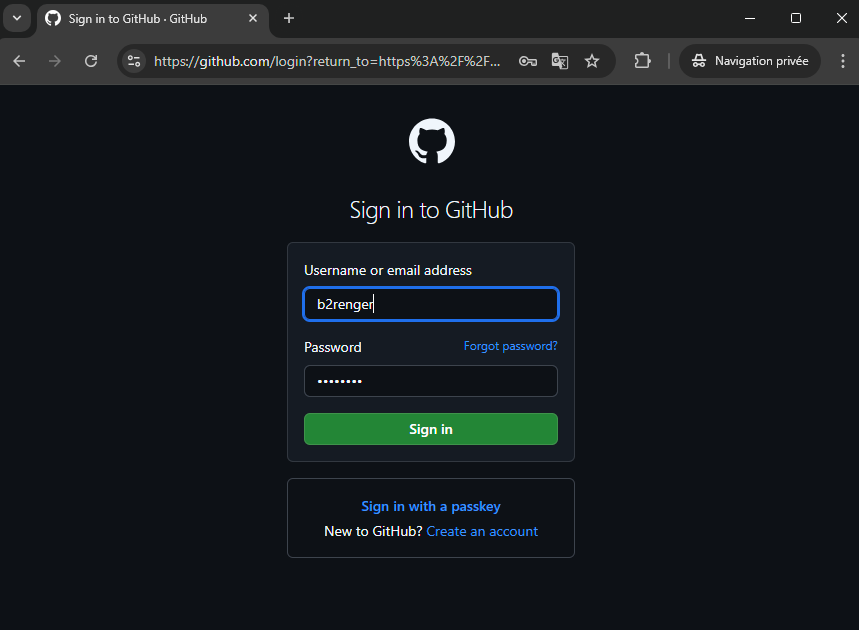
</div>

- Créer un nouveau dépôt : Une fois connecté, cliquez sur le bouton "New repository".
- Donnez un nom à votre dépôt (par exemple, "microProjetAr"),
- (Ajoutez une description facultative),
- **Activez** l'option Add README.
- et cliquez sur "Create repository".

<div align="center"> 
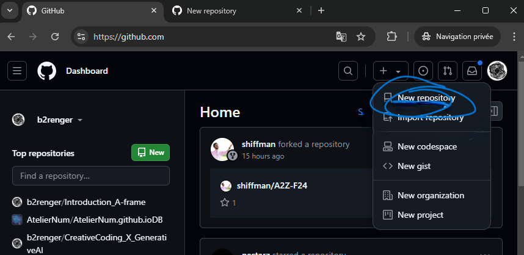
</div>
</br>
<div align="center"> 

</div>

# Étape 2 : Activer GitHub Pages

Nous allons maintenant configurer GitHub Pages, pour permettre à notre projet d'être servi par les serveurs de GitHub lorsque l'on rentre l'adresse :

https://_[votre-nom-utilisateur]_.github.io/_[votre-depot]_

- Accéder aux paramètres : Dans votre dépôt, cliquez sur l'onglet "Settings", puis sur l'onglet "Pages"

<div align="center"> 
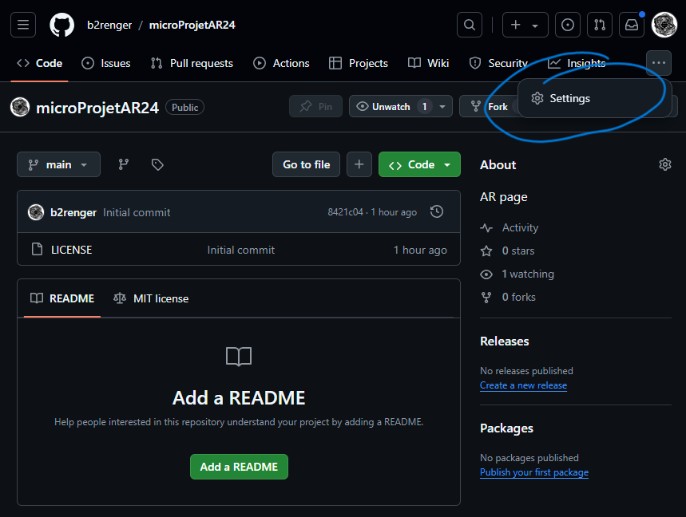
</div>
</br>
<div align="center"> 
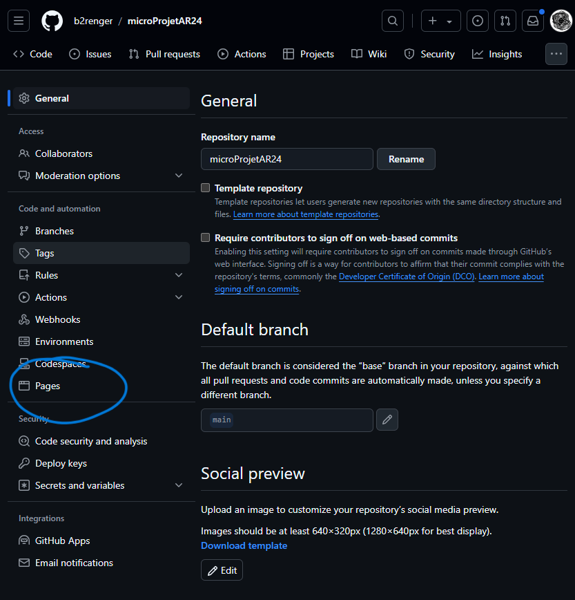
</div>

- Sélectionner la branche : Dans la section "GitHub Pages", sélectionnez la branche "main" (ou la branche principale de votre dépôt).
- Enregistrer les modifications : Cliquez sur le bouton "Save". Votre site GitHub Pages sera maintenant accessible à l'adresse https://[votre-nom-utilisateur].github.io/[microprojetAr].

<div align="center"> 
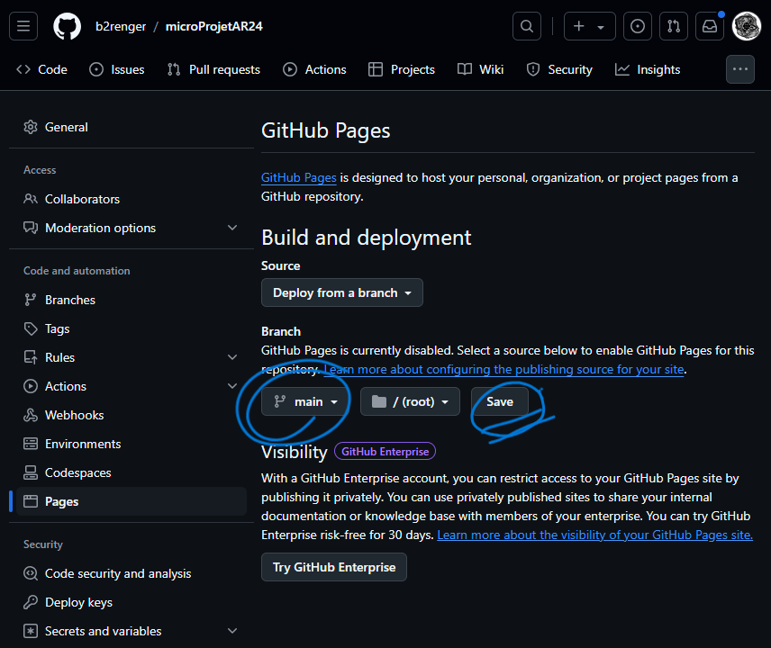
</div>

Si vous revenez sur la page d'accueil de votre projet, vous remarquerez au bout de quelques minutes, que certains éléments ont changé. Un déploiement est maintenant disponible !

<div align="center"> 
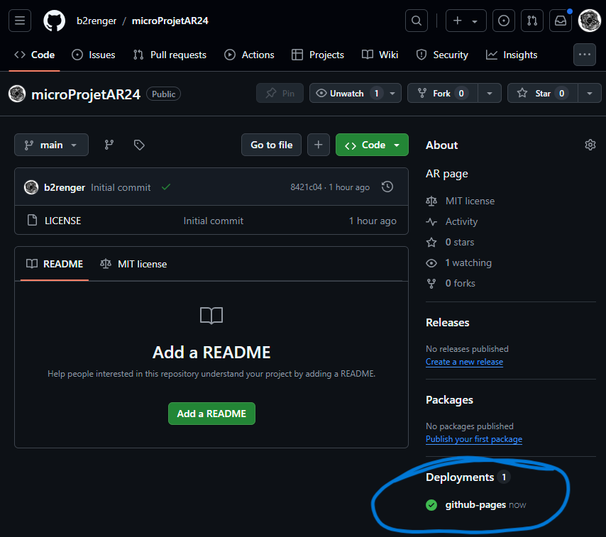
</div>

Toute l'infrastructure nécessaire pour héberger votre projet est donc bien en place, il suffit maintenant d'ajouter du contenu.

# Étape 3 : Utiliser Visual Studio Code

Rendez-vous sur [Visual Studio Code](https://code.visualstudio.com/), téléchargez, et installez-le.

Une fois ouvert vous devriez voir ceci :

<div align="center"> 
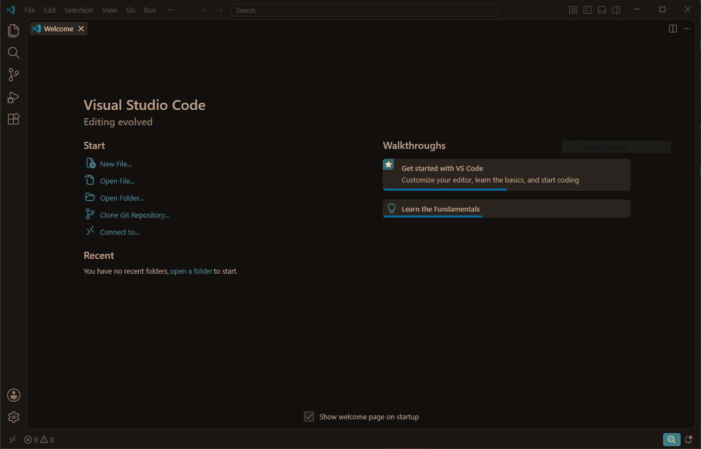
</div>

Téléchargez votre projet :

<div align="center"> 
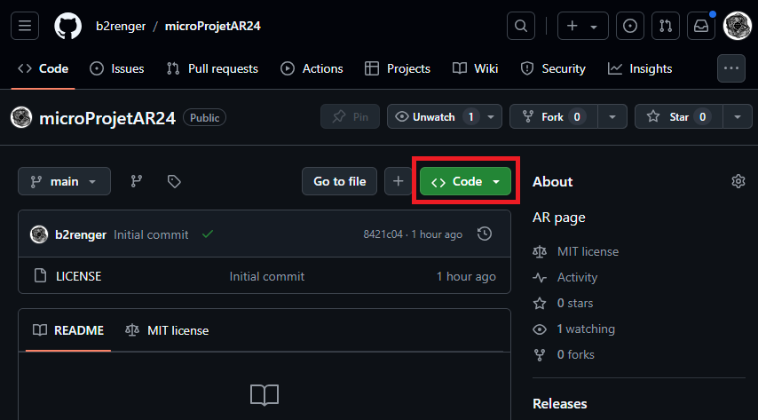
</div>

Dézippez le projet, ce qui devrait nous donner un dossier du même nom.

<div align="center"> 
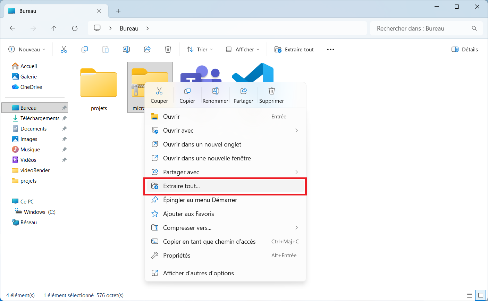
</div>

Vérifiez que vous n'avez pas un dossier portant le nom du projet à L'INTÉRIEUR du dossier dézippé, si c'est le cas le projet est le dossier intérieur.

Ouvrez-le dans VSCode en cliquant sur `File > Open Folder`

Acceptez d'ouvrir le projet dans VSCode, après tout c'est pour ça qu'on vient de le télécharger.

<div align="center"> 
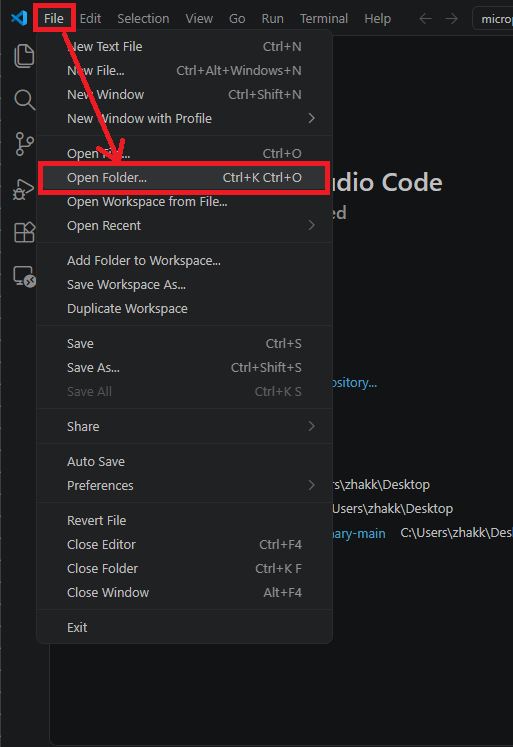
</div>

Il est possible que VSCode vous demande si oui ou non vous faites confiance au projet, en sachant qu'il est bien a nous et qu'il est vide, dites oui puisqu'on a besoin que VSCode soit en mode complet en non restreint.

Alternativement, il est possible que VSCode ne vous propose rien et demarre directement en mode restreint, si c'est le cas vous verrez ce petit ruban en haut de votre fenetre VSCode.

<div align="center"> 
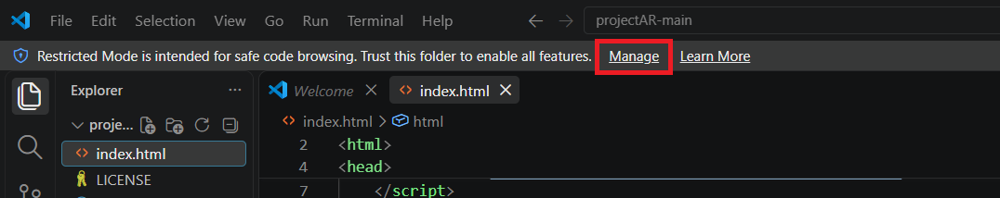
</div>

Auquel cas, cliquez sur "Manage", acceptez puis fermez.

<div align="center"> 
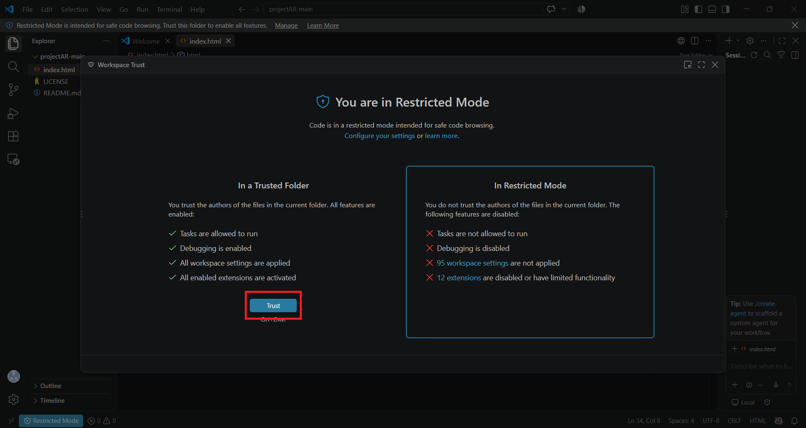
</div>

<div align="center"> 
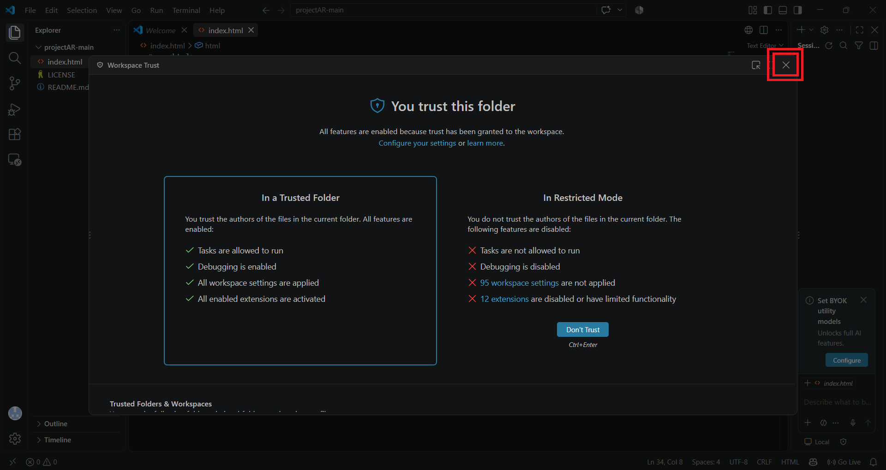
</div>

> [!TIP]
> Il est vivement recommandé de ranger votre projet plutôt que de le mettre sur le bureau ou dans le dossier téléchargement.

<div align="center"> 
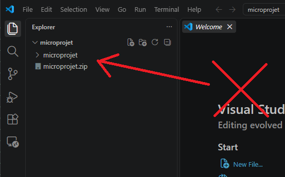
</div>

> [!CAUTION]
> Si vous voyez ceci, le projet est mal ouvert et il faut bien faire attention à prendre le dossier intérieur.

Maintenant vous devriez avoir une copie du projet dans vos dossiers et ouvert dans VSCode.

Cependant pour être prêts à travailler il nous manque une extension pour visualiser notre site web. Allons dans le menu des extensions pour chercher "Live Server"

<div align="center"> 

</div>

<div align="center"> 

</div>

Et voilà ! On peut maintenant faire du web, l'environnement dans lequel on va se servir de A-Frame.

<!-- # Étape 3 : Utiliser Firebase Studio

Rendez-vous sur [Firebase Studio](https://studio.firebase.google.com) et connectez-vous.

<blockquote id="parental">
<details>
<summary>Problème de contrôle parental? Ou de restriction d'âge?</summary>


Et à partir de celle-là, il faut revenir en arrière (mais c'est important de visiter cette page)


</details>
</blockquote>

Importer le dépôt : Utilisez l'option pour importer votre dépôt GitHub.

<div align="center">

</div>

Copiez l'adresse du dépôt créé précédemment.
<div align="center">


</div>

Configurer le projet pour un usage de développement web.

- Créer un dossier ".idx":
  <div align="center">
  
  </div>

- Dans ce dossier, créer un fichier nommé "dev.nix"
  <div align="center">
  
  </div>
  Pour arriver à ce résultat :
   <div align="center">
  
  </div>

- Copier le code de configuration de l'environnement de développement dans le fichier "dev.nix" que vous venez de créer. (Ce fichier va nous permettre de tester notre code directement dans Firebase Studio et aussi de tester sur notre téléphone).

  ```nix
    # To learn more about how to use Nix to configure your environment
  # see: https://developers.google.com/idx/guides/customize-idx-env
  { pkgs, ... }: {
    # Which nixpkgs channel to use.
    channel = "stable-23.11"; # or "unstable"
    # Use https://search.nixos.org/packages to find packages
    packages = [
      pkgs.nodejs_20
      pkgs.python3
    ];
    # Sets environment variables in the workspace
    env = {};
    idx = {
      # Search for the extensions you want on https://open-vsx.org/ and use   "publisher.id"
      extensions = [
        # "vscodevim.vim"
      ];
      # Enable previews and customize configuration
      previews = {
        enable = true;
        previews = {
          web = {
            command = ["python3" "-m" "http.server" "$PORT" "--bind" "0.0.0.0"];
            manager = "web";
          };
        };
      };
      # Workspace lifecycle hooks
      workspace = {
        # Runs when a workspace is first created
        onCreate = {
          # Example: install JS dependencies from NPM
          # npm-install = "npm install";
          # Open editors for the following files by default, if they exist:
          default.openFiles = [ "style.css" "main.js" "index.html" ];
        };
        # Runs when the workspace is (re)started
        onStart = {
          # Example: start a background task to watch and re-build backend code
          # watch-backend = "npm run watch-backend";
        };
      };
    };
  }
  ```
Votre environnement de travail devrait ressembler à ceci :

  <div align="center">
  
  </div>

Il ne vous reste plus qu'à cliquer sur le bouton "Rebuild Environment" et c'est bon !

En théorie Firebase Studio devrait se recharger pour prendre en compte les changements spécifiés dans le `dev.nix` mais si ce n'est pas le cas, utilisez la palette avec `Ctrl + Shift + P` (`Cmd + Shift + P` sur Mac) et cherchez "rebuild" pour trouver l'option "rebuild environment".

 -->

# Étape 4 : Créer la page web

Créer un fichier nommé **"index.html"**.

<div align="center"> 
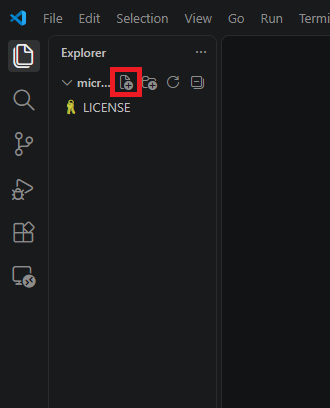
</div>

Ajouter le code HTML : Copiez et collez le code HTML suivant dans votre fichier index.html :

```HTML
<!doctype html>
<html>

<head>
    <title>MicroProjetAR</title>
    <script src="https://aframe.io/releases/1.3.0/aframe.min.js">
    </script>
    <script src="https://raw.githack.com/AR-js-org/AR.js/3.4.5/aframe/build/aframe-ar.js">
    </script>
    <script src="https://cdn.jsdelivr.net/npm/eruda"></script>
    <script type="module" src="https://raw.githack.com/b2renger/microprojetar/main/lib/qrTunnel.js"></script>

</head>


<body style="margin : 0px; overflow: hidden;">
    <a-scene embedded
        arjs="sourceType: webcam; detectionMode: mono_and_matrix; matrixCodeType: 3x3; trackingMethod: best ; changeMatrixMode: modelViewMatrix;"
        vr-mode-ui="enabled: false"
        renderer="sortObjects: true; antialias: true; colorManagement: true; physicallyCorrectLights; logarithmicDepthBuffer: true;"
        smooth=" true" smoothCount="5" smoothTolerance=".05" smoothThreshold="5" sourceWidth="800" sourceHeight="600"
        displayWidth="1280" displayHeight="720">

        <a-marker type='barcode' value='0'>
            <a-text value="Hello !" side="double" position="0 0 -1" rotation="270 0 0" width="8" color="red"
                align="center">
            </a-text>
        </a-marker>

        <a-entity camera></a-entity>

    </a-scene>
</body>
</html>
```

# Étape 5 : Comprendre le code

Ce code crée une expérience simple de réalité augmentée (RA) en utilisant A-Frame et AR.js. Décomposons ce que fait chaque partie :

Si vous n'êtes pas à l'aise et ne connaissez pas du tout la manière dont du code HTML fonctionne, cliquez sur le petit triangle pour déplier une explication des bases de la syntaxe HTML.

<details > <summary> <b>&#128161; les bases html</b> </summary>

Une page HTML est comme un sandwich. Elle a besoin d'un pain du haut et d'un pain du bas pour contenir la garniture !

Le pain du haut et du bas, ce sont les balises `<html>` et `</html>`. Elles indiquent au navigateur que le contenu entre ces balises est du code HTML.

Deux parties principales : À l'intérieur du "sandwich HTML", on trouve deux parties :

**La tête** (`<head>` et `</head>`) : C'est comme les informations sur l'emballage du sandwich. On y met des informations importantes pour le navigateur, mais qui ne sont pas affichées directement à l'utilisateur.

Par exemple :

- Le titre de la page `<title>` qui décrit au navigateur quoi afficher dans la barre d'onglets.

- Des liens vers des fichiers CSS pour charger la mise en page

- Des liens vers des fichiers JavaScript pour les fonctionnalités interactives

**Le corps** (`<body>` et `</body>`) : C'est la garniture du sandwich ! C'est le contenu visible de la page web : texte, images, vidéos, etc.

La syntaxe et donc l'interprétation par le navigateur du code HTML repose sur des balises ouvrantes et fermantes :

- La balise **ouvrante** (par exemple `<p>`) dit au navigateur : "Attention, on commence un paragraphe !"
- La balise fermante (par exemple `</p>`) dit : "Voilà, le paragraphe est terminé."

Tout le contenu entre la balise ouvrante et la balise fermante est considéré comme faisant partie de cet élément.

Exemple :

```html
<html>
  <head>
    <title>Ma page web</title>
  </head>
  <body>
    <h1>Bienvenue !</h1>
    <p>Ceci est un paragraphe de texte.</p>
  </body>
</html>
```

Dans cet exemple :

- `<html>` ouvre la page HTML et `</html>` la ferme.
- `<head>` ouvre la section d'en-tête et `</head>` la ferme.
- `<title>` ouvre le titre de la page et `</title>` le ferme.
- `<body>` ouvre le corps de la page et `</body>` le ferme.
- `<h1>` ouvre un titre de niveau 1 et `</h1>` le ferme.
- `<p>` ouvre un paragraphe et `</p>` le ferme.

</details>
</br>

Ici nous avons une structure HTML classique : Le code met en place une page HTML basique avec les sections `<head>` et `<body>`.

Dans la partie `<head>`, nous ajoutons :

- le titre de l'expérience

  ```html
  <title>Ma première app AR</title>
  ```

- la _Bibliothèque A-Frame_ : Il inclut la bibliothèque A-Frame (aframe.min.js) qui est un framework JavaScript permettant de créer des expériences de réalité virtuelle (RV) et de RA en utilisant du HTML.
  Une bibliothèque est simplement du code que l'on amène dans le projet pour ajouter des fonctionnalités supplémentaires. Un framework est une bibliothèque qui nécessite de respecter certaines règles pour bien marcher, mais en échange un framework est plus puissant qu'une bibliothèque normale.

  ```html
  <script src="https://aframe.io/releases/1.3.0/aframe.min.js"></script>
  ```

- la _Bibliothèque AR.js_ : Il inclut la bibliothèque AR.js (aframe-ar.js) qui ajoute des capacités de RA à A-Frame.
  ```html
  <script src="https://raw.githubusercontent.com/jeromeetienne/AR.js/master/aframe/build/aframe-ar.js"></script>
  ```

- la _console Eruda_ : Il s'agit un petit bouton qui se mettra en bas à droite de votre écran et qui nous permettra de voir les messages d'erreur sur votre téléphone.
```html
<script src="https://cdn.jsdelivr.net/npm/eruda"></script>
```

- la _Bibliothèque qrTunnel_ : C'est une fonctionnalité qui affichera un QR code pour facilement ouvrir la page web sur votre téléphone. Le QR code ne s'affichera que si votre écran est grand et que la page est bien exposée au travers d'une redirection de ports comme on le verra un peu plus tard.
```html
<script type="module" src="https://raw.githack.com/b2renger/microprojetar/main/lib/qrTunnel.js"></script>
```

Dans la partie `<body>`, et c'est ici que tout se joue pour le contenu visible par l'utilisateur. Nous ajoutons :

- la _scène RA_ : L'élément `<a-scene>` crée la scène de RA.

  ```html
  <a-scene
    embedded
    arjs="sourceType: webcam; detectionMode: mono_and_matrix; matrixCodeType: 3x3; trackingMethod: best ; changeMatrixMode: modelViewMatrix;"
    renderer="sortObjects: true; antialias: true; colorManagement: true; physicallyCorrectLights; logarithmicDepthBuffer: true;"
    vr-mode-ui="enabled: false"
    smooth=" true"
    smoothCount="5"
    smoothTolerance=".05"
    smoothThreshold="5"
    sourceWidth="800"
    sourceHeight="600"
    displayWidth="1280"
    displayHeight="720"
  >
    <!-- contenu de l'expérience AR avec d'autres balises -->
  </a-scene>
  ```

  Remarquez que dans la balise ouvrante `<a-scene>` nous ajoutons beaucoup d'options (qui s'appellent attributs en HTML) pour configurer la manière dont la scène va s'afficher.

  <details > <summary> <b>&#128161; les détails des options de configuration de l'attribut arjs</b> </summary>

  - *embedded* : Cet attribut indique à A-Frame d'intégrer la scène dans la page HTML.
  - _arjs_ : Cet attribut configure AR.js
    - _sourceType: webcam_ : Utilise la webcam de l'appareil comme source vidéo.
    - _detectionMode: mono_and_matrix_ : Détecte à la fois les images cibles et les marqueurs de type code-barres.
    - _matrixCodeType: 3x3_ : Spécifie que le type de code-barres utilisé est un code-barres matriciel 3x3.
    - _trackingMethod: best_ : Utilise la meilleure méthode de suivi disponible.
    - _changeMatrixMode: modelViewMatrix_ : Mode de changement de matrice pour le suivi.
    - _vr-mode-ui="enabled: false"_ : Désactive l'interface utilisateur du mode VR.
    - _renderer_. Configure le rendu de la scène avec des options pour le tri des objets, l'antialiasing, la gestion des couleurs, etc.
    - _smooth_ : Active le lissage du mouvement de la caméra.

    </details>
    </br>

- Le _marqueur_ : L'élément `<a-marker>` définit un marqueur de type code-barres avec la valeur '2'. Lorsque la caméra détecte ce marqueur, le contenu à l'intérieur de la balise sera affiché en RA.

  ```html
  <a-marker type="barcode" value="0">
    <!-- ajouter du contenu qui sera visible par l'utilisateur et donc ancré sur notre marqueur -->
  </a-marker>
  ```

  Ici la valeur 9 correspond à un motif précis qui a été prédécoupé pour vous à la [découpeuse de stickers](https://github.com/LucieMrc/SilhouetteCameo_2spi). Avec la technique que nous utilisons [il existe 64 motifs différents](https://github.com/b2renger/Introduction_A-frame/blob/main/markers/barcodes/2.png) qui peuvent être détectés en même temps par AR.js.

- Un texte : L'élément `<a-text>` crée un texte en 3D qui sera affiché au-dessus du marqueur. Le texte est "Hello !", de couleur rouge et centré.

  ```html
  <a-text
    value="Hello !"
    side="double"
    position="0 0 -1"
    rotation="270 0 0"
    width="8"
    color="red"
    align="center"
  >
  </a-text>
  ```

    <details > <summary> <b>&#128161; les détails des attributs de la balise a-text</b> </summary>

  - *value* : Le texte à afficher.
  - *side=double* : permet d'afficher le texte quel que soit l'angle sous lequel on le regarde.
  - *position="0 0 -1"* : la position xyz du centre du texte par rapport au centre du marqueur.
  - *rotation="270 0 0"* :
  - *width="8"* : la largeur du texte.
  - *color="red"* : la couleur du texte.
  - *align="center"* : l'alignement du texte.
  
  </details>
  </br>

- Caméra : L'élément `<a-entity camera>` définit la caméra de la scène, le fonctionnement par défaut nous convient parfaitement, mais il est possible d'ajouter des fonctionnalités comme par exemple l'interaction via l'orientation du regard ('gaze' interaction).

En résumé, ce code crée une expérience de RA où un texte apparaît dans un espace 3D lorsque le marqueur code-barres 0 est détecté par la caméra.

# Étape 6 : Tester sur ordinateur

- Enregistrer les modifications : Enregistrez votre fichier index.html.

Démarrez l'extension Live Server :

1. Ouvrez la palette avec `Ctrl + Shift + P`
2. Saisissez `Live` pour ne voir que les options liées à Live Server
3. Choisissez `Live Server : Open with Live Server`

<div align="center"> 
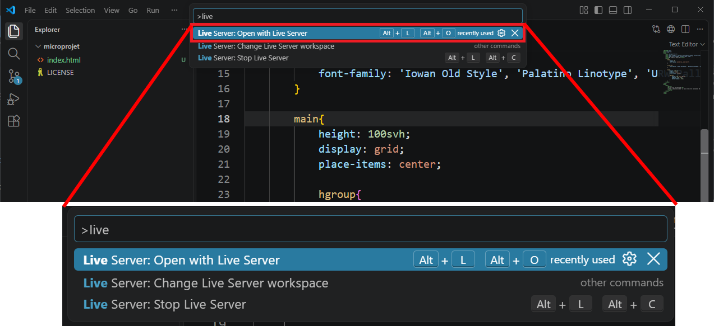
</div>

Votre site va automatiquement s'ouvrir dans votre navigateur web par défaut.

<!-- # Étape 7 : Tester son site depuis son téléphone

Vous pourrez constater (sauf si vous êtes sur Safari) que l'adresse de votre page est `http://127.0.0.1:5500/index.html`

<div align="center"> 

</div>

Quand vous visitez un lien, votre navigateur va demander une page web à l'adresse renseignée.

<details> <summary> c'est marqué `http://` et pas `https://` c'est quoi la différence?</summary>

Le `S` veut dire "Secure".

La différence est que dans une demande HTTP, toutes les machines, qui vont faire passer la demande jusqu'au serveur de destination, peuvent lire votre message. Tandis qu'avec HTTPS uniquement vous et le serveur en bout de chaîne comprennent les messages que vous vous échangez.

C'est ça qui vous protège, et pas les VPNs qui vous gavent de pub.

</details>

`127.0.0.1` est une adresse spéciale parce qu'elle veut dire "moi-même". Autrement dit, sur mon ordinateur `127.0.0.1` est mon ordinateur, mais sur votre ordinateur `127.0.0.1` est le vôtre.

En l'état, votre site n'est pas accessible depuis Internet, donc il n'est pas _facilement_ accessible depuis votre téléphone, or on va avoir besoin de la caméra et des capteurs de mouvement de votre téléphone pour l'AR.

Donc on va utiliser un service gracieusement fourni par Microsoft (qui possède GitHub et VSCode), et on va "forward un port", ce qui veut dire qu'on va demander à Microsoft d'être un relais vers l'extérieur pour une de nos applications (Live Server dans ce cas).

Cliquez sur l'icône tout dans le coin inférieur gauche et sélectionnez "Tunnel"

<div align="center"> 
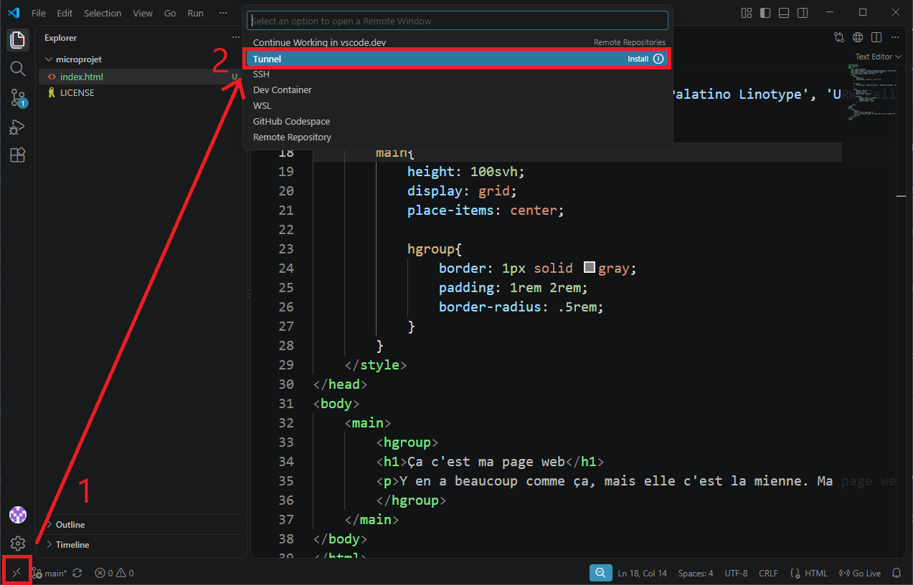
</div>

Sélectionnez une connexion via votre compte GitHub qui devrait déjà être lié à votre VSCode.

<div align="center"> 
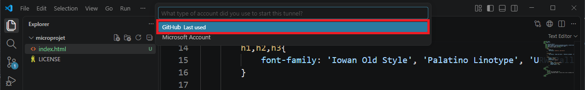
</div>

<div align="center"> 

</div>

<div align="center"> 

</div>

Appuyez sur la touche `Esc` de votre clavier.

<div align="center"> 
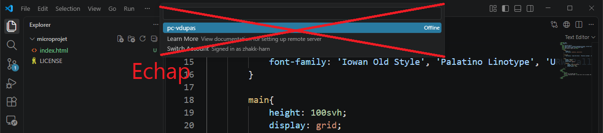
</div>

Ouvrez la palette `Ctrl + Shift + P` et sélectionnez `Forward a Port`

<div align="center"> 

</div>

Rentrez le numéro du port utilisé par Live Server. Dans ce cas il s'agit du port 5500.

<div align="center"> 
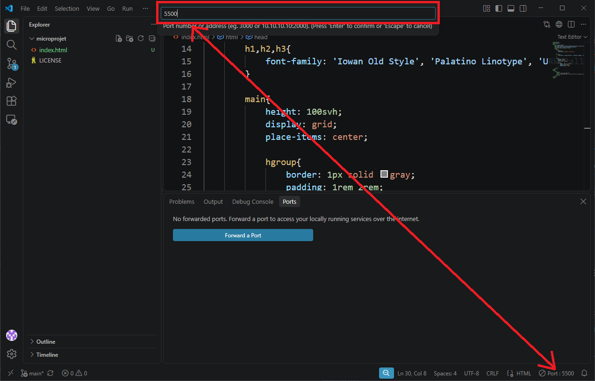
</div>

<div align="center"> 
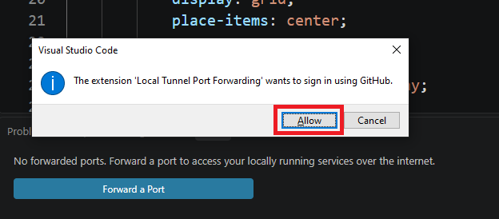
</div>

Autorisez la redirection de ports au nom du compte que vous venez de connecter.

<div align="center"> 

</div>

Ouvrez la redirection de votre port.

<div align="center"> 

</div>

<div align="center"> 
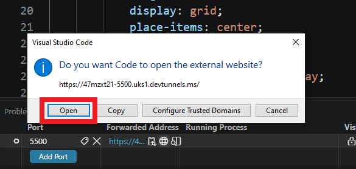
</div>

Microsoft va vous informer qu'ils vont vous diriger vers une page en cours de développement.

<div align="center"> 

</div>

Vous pouvez constater que vous avez accès à votre site web au travers d'une adresse `devtunnels.ms`.

D'ailleurs, si vous changez votre page web dans VSCode et que vous sauvegardez, vous verrez que les changements se font directement dans votre page web, prouvant qu'elle est bien fournie par Live Server. (Il est possible que vous ayez besoin de rafraîchir la page une fois pour que la synchronisation Live Server se mette bien en place).

Pour l'ouvrir sur votre téléphone vous pouvez tout simplement scanner le QR présent lors de l'ouverture de la page sur ordinateur.

Cependant ce tunnel n'acceptera que vous, au travers de votre compte GitHub, donc il faut aussi se loguer sur son téléphone.

<div align="center"> 

</div> -->

# Étape 7 : Publier l'application

Allez sur la page "Code" de votre projet GitHub et cliquez sur `Add file > Upload files`

<div align="center"> 
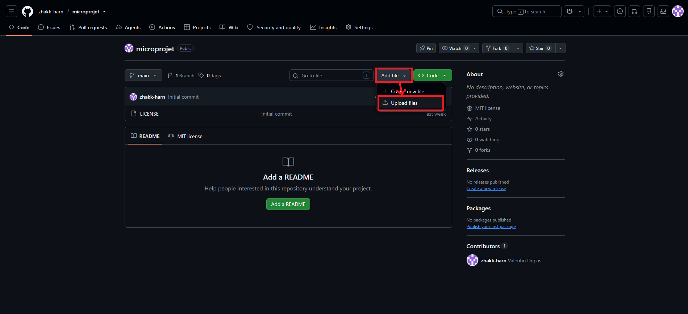
</div>

Ouvrez le dossier de votre projet depuis votre explorateur de fichiers ou votre Finder.

Si vous avez du mal à le trouver, vous pouvez faire un clic droit sur un fichier depuis VSCode et sélectionner `Reveal in File Explorer` ou `Reveal in Finder`.

<div align="center"> 
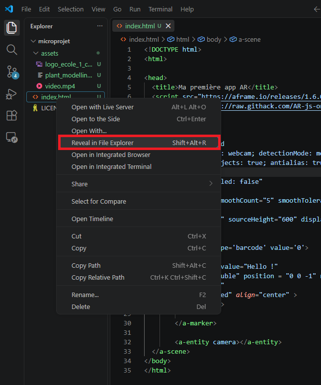
</div>

Et transférez tous vos fichiers. Ce n'est pas élégant et ça ne marchera pas passé une certaine taille de projet mais pour le moment c'est ok.

<div align="center"> 
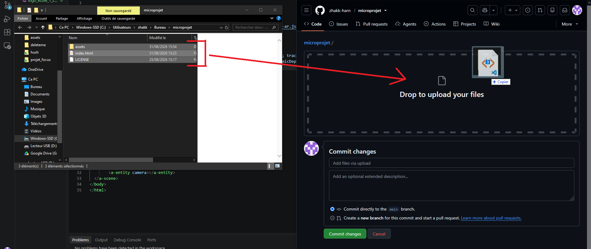
</div>

Puis cliquez sur "Commit changes"

**Votre expérience est maintenant déployée à l'adresse :** _https://[votre-nom-utilisateur].github.io/[votre-depot]_

**✨ Félicitations ! ✨** Vous avez créé votre première application AR. Vous pouvez maintenant personnaliser votre application en modifiant le texte, en ajoutant des modèles 3D, et en expérimentant avec différentes fonctionnalités d'A-Frame et AR.js.

Note : Ce tutoriel est une introduction de base. Pour approfondir vos connaissances, consultez la documentation officielle d'A-Frame et AR.js.

# Étape 8 : Encoder le sticker RFID

Notre but est de programmer notre sticker RFID pour que lorsque nous approchons notre téléphone, celui-ci va nous proposer d'ouvrir la page web hébergeant notre projet.

Pour cela nous allons utiliser NFC Tools qui est gratuit et qui est disponible pour [Android](https://play.google.com/store/apps/details?id=com.wakdev.wdnfc&hl=fr) ou [iOS](https://apps.apple.com/fr/app/nfc-tools/id1252962749).

- Choisir l'onglet "Écrire" et sélectionner "ajouter un enregistrement"
  <div align="center"> 
  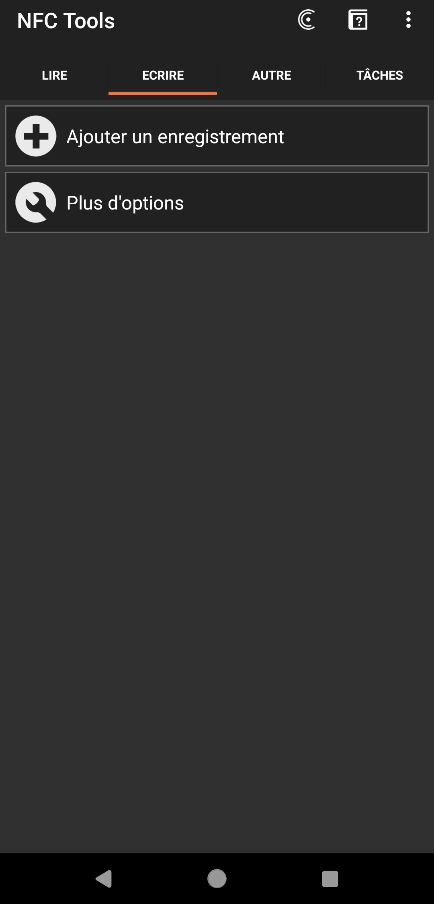
  </div>
- Choisir "URL/URI"
  <div align="center"> 
  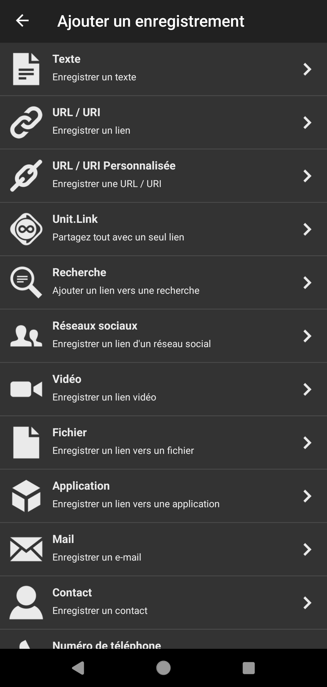
  </div>
- Entrer l'adresse de votre page puis valider
  <div align="center"> 
  
  </div>
- Vous pouvez maintenant cliquer sur le bouton "Écrire" sous le champ "Plus d'options"
  <div align="center"> 
  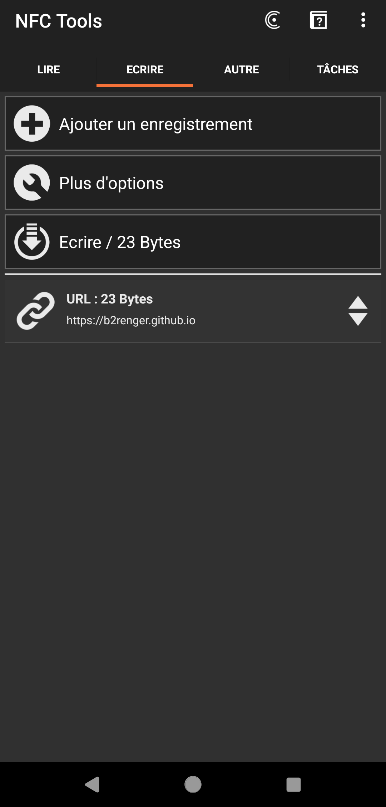
  </div>
- Vous devriez voir cet écran vous demandant d'approcher votre smartphone du sticker.
  <div align="center"> 
  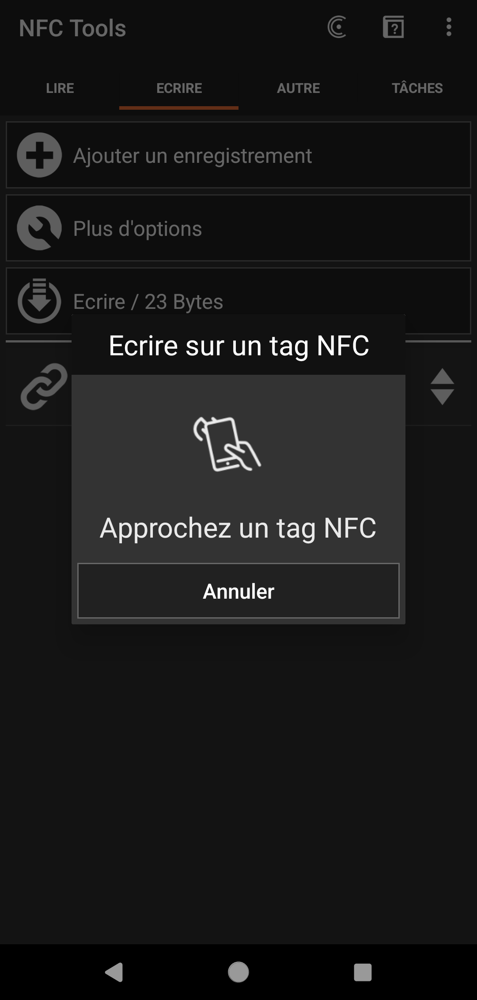
  </div>
- Une fois que vous avez réussi à détecter votre sticker, l'écriture devrait s'effectuer
  <div align="center"> 
  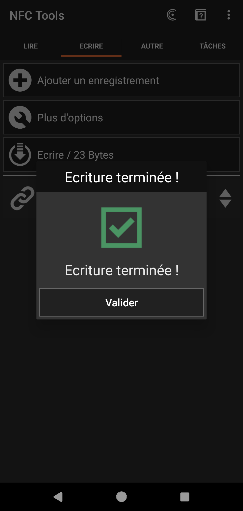
  </div>

Normalement c'est bon !
Vous pouvez fermer NFC Tools et tester !

# Pour aller plus loin ...

Un cours entier en anglais est disponible sur [le site de l'ateliernum](http://ateliernum.github.io) à cette adresse : https://github.com/b2renger/Introduction_A-frame#introduction_a-frame

Personnaliser l'apparence : Ajouter d'autres éléments, modifier les couleurs, les tailles et les positions des éléments.

Ajouter des modèles 3D : Importer des modèles 3D dans votre scène.

Utiliser d'autres types de marqueurs : Explorer les différents types de marqueurs AR.

Créer des interactions : Ajouter des événements et des interactions à votre application.

Mais si vous êtes arrivés ici vite vous méritez un peu d'aide avec des templates pour ajouter une image, un modèle 3D ou une vidéo.

## Charger des assets

Vous pouvez télécharger un zip avec : une image, un modèle 3D et une vidéo [à cette adresse](https://github.com/b2renger/microprojetar/releases/download/v1.1/assets.zip).

### Les formats d'assets

Les assets sont des fichiers qui peuvent être utilisés dans votre application, cela peut être : des images, des modèles 3D, des sons, des vidéos.

Nous sommes dans un contexte web du coup il faut que ces fichiers soient légers pour se charger vite et optimisés.

- prévoyez des images et vidéos dans une résolution 1920x1080 pixels maximum
  - pour les vidéos encodées en H.264 et au format mp4
  - pour les images au format PNG ou JPEG.

- pour les 3D cela sera des modèles 3D au format GLB (le format du web), exportable depuis Blender.

Vos fichiers ne doivent pas faire plus de 5 Mo (même si pour une image c'est déjà énorme).

Vous pourrez trouver un pack d'assets à cette adresse :
https://github.com/b2renger/microprojetar/releases/download/v1.1/assets.zip

### Ajouter des fichiers dans VSCode

C'est une bonne pratique de mettre nos fichiers assets dans un dossier séparé.

Nous allons donc créer un dossier 'assets' dans le projet. C'est la même chose que lorsque nous avons créé un dossier pour notre fichier de configuration.

<div align="center">
  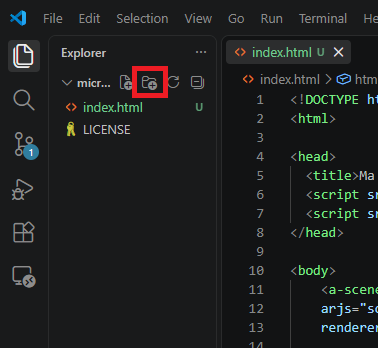
</div>

Vous pouvez ensuite déplacer des fichiers dans ce nouveau dossier - évitez les accents, les espaces et les caractères spéciaux dans les noms de fichiers.

<div align="center"> 
  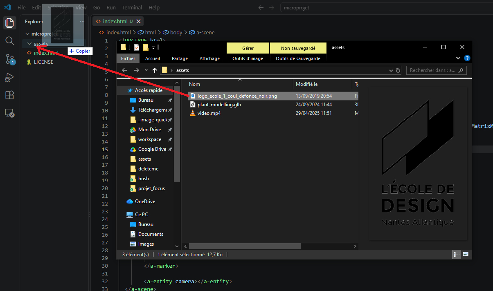
</div>

Si vous avez importé tous les assets du fichier zip, cela devrait ressembler à cela :

<div align="center"> 
  
</div>

Maintenant il faut charger les fichiers dans notre scène A-Frame.

### Les charger dans notre scène

Chaque type de fichier a un mode de chargement différent. Cela se fait entre les balises `<a-scene>` ... et `</a-scene>`

Notez bien qu'il faut adapter ces nouveaux éléments au nom de nos fichiers :

- Dans le paramètre "src", nous chargeons le fichier nommé "nom_du_fichier.png" qui est rangé dans le dossier asset.
- Dans le paramètre "id" nous choisissons un alias qui nous permettra de référencer ce fichier sans avoir à retaper son nom.

Pour les images :
Nous chargeons le fichier `logo_ecole_1_coul_defonce_noir.png` qui est rangé dans le dossier asset.

```html
<a-assets>
  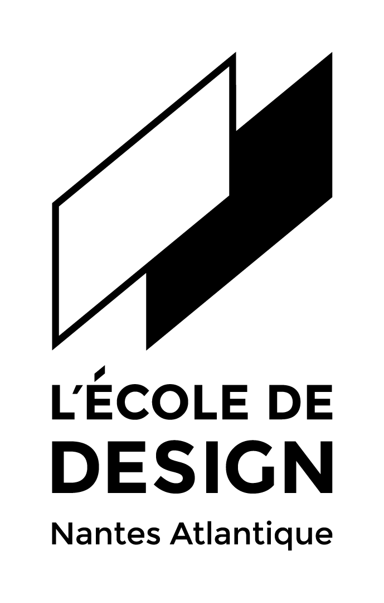
</a-assets>
```

Pour les modèles 3D :
Nous chargeons le fichier `plant_modelling.glb` qui est rangé dans le dossier asset.

```html
<a-assets>
  <a-asset-item id="glbTest" src="./assets/plant_modelling.glb"></a-asset-item>
</a-assets>
```

Pour les vidéos :
Nous chargeons le fichier vidéo qui est rangé dans le dossier asset.

```html
<a-assets>
  <!--point to your *mp4 file : h264, AAC etc-->
  <video
    src="./assets/video"
    muted="true"
    loop="true"
    controls="false"
    playsinline
    webkit-playsinline
    type="video/mp4"
    id="vid"
  ></video>
</a-assets>
```

## Exemples de code

Les exemples fournis ci-dessous sont complets et fonctionnels, vous pouvez les copier / coller directement dans votre fichier index.html

### Images

Vous aurez besoin d'adapter la largeur "width" et la hauteur "height" de l'image selon l'aspect ratio de votre image pour qu'elle ne soit pas déformée.

```html
<!doctype html>
<html>

<head>
    <title>MicroProjetAR</title>
    <script src="https://aframe.io/releases/1.3.0/aframe.min.js">
    </script>
    <script src="https://raw.githack.com/AR-js-org/AR.js/3.4.5/aframe/build/aframe-ar.js">
    </script>
</head>

<body style="margin : 0px; overflow: hidden;">
    <a-scene embedded
        arjs="sourceType: webcam; detectionMode: mono_and_matrix; matrixCodeType: 3x3; trackingMethod: best ; changeMatrixMode: modelViewMatrix;"
        vr-mode-ui="enabled: false"
        renderer="sortObjects: true; antialias: true; colorManagement: true; physicallyCorrectLights; logarithmicDepthBuffer: true;"
        smooth=" true" smoothCount="5" smoothTolerance=".05" smoothThreshold="5" sourceWidth="800" sourceHeight="600"
        displayWidth="1280" displayHeight="720">

        <a-marker type='barcode' value='0'>
            <a-image src="another-image.png" width="1" height="1"></a-image>
        </a-marker>

        <a-entity camera></a-entity>
    </a-scene>
</body>
</html>
```

### 3D

Pensez à adapter le paramètre scale en fonction des unités d'export de votre modèle.

```html
<!DOCTYPE html>
<html>
  <head>
    <title>Ma première app AR</title>
    <script src="https://aframe.io/releases/1.6.0/aframe.min.js"></script>
    <script src="https://raw.githack.com/AR-js-org/AR.js/master/aframe/build/aframe-ar.js"></script>
  </head>

  <body>
    <a-scene
      embedded
      arjs="sourceType: webcam; detectionMode: mono_and_matrix; matrixCodeType: 3x3; trackingMethod: best ; changeMatrixMode: modelViewMatrix;"
      renderer="sortObjects: true; antialias: true; colorManagement: true; logarithmicDepthBuffer: true;"
      vr-mode-ui="enabled: false"
      smooth=" true"
      smoothCount="5"
      smoothTolerance=".05"
      smoothThreshold="5"
      sourceWidth="800"
      sourceHeight="600"
      displayWidth="1280"
      displayHeight="720"
    >

      <a-marker type="barcode" value="0">
        <a-entity scale=".1 .1 .1" gltf-model="./assets/plant_modelling.glb"></a-entity>
      </a-marker>

      <a-entity camera></a-entity>
    </a-scene>
  </body>
</html>
```

### Vidéo (le plus compliqué)

Dans cet exemple très complexe, nous ajoutons un script JavaScript dans le head de la page.

Ce script permet de gérer la lecture automatique de la vidéo, quand le marqueur est détecté. Malgré cela, cela ne marche pas à tous les coups (on parle bien ici de Safari et iOS...)

Il permet aussi de créer un chromakey, c'est-à-dire de rendre une couleur transparente (par exemple un fond vert, au hasard ;))

Bref il y a beaucoup de code au début !

Pensez quand même à changer les noms de fichiers et les ids pour qu'ils correspondent à vos fichiers.

<div align="center"> 
  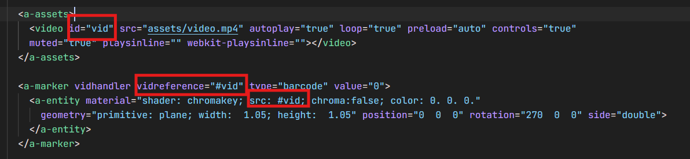
</div>

Il faudra aussi penser à l'aspect ratio comme pour les images avec les paramètres 'width' et 'height' de l'élément.

```html
<!DOCTYPE html>
<html>
  <head>
    <title>Ma première app AR</title>
    <script src="https://aframe.io/releases/1.6.0/aframe.min.js"></script>
    <script src="https://raw.githack.com/AR-js-org/AR.js/master/aframe/build/aframe-ar.js"></script>
    <script defer>
      // https://github.com/nikolaiwarner/aframe-chromakey-material
      AFRAME.registerShader("chromakey", {
        schema: {
          src: { type: "map" },
          color: {
            default: { x: 0.0, y: 1.0, z: 0.0 },
            type: "vec3",
            is: "uniform",
          },
          chroma: { type: "bool", is: "uniform" },
          transparent: { default: true, is: "uniform" },
        },

        init: function (data) {
          const videoEl = data.src;
          document.addEventListener("click", () => {
            videoEl.play();
            const entity = document.querySelector("[sound]");
            // console.log(entity)
            // console.log(document.querySelector("#debug-marker"))
            entity.components.sound.playSound();
          });

          var videoTexture = new THREE.VideoTexture(data.src);
          videoTexture.minFilter = THREE.LinearFilter;
          this.material = new THREE.ShaderMaterial({
            uniforms: {
              chroma: {
                type: "b",
                value: data.chroma,
              },
              color: {
                type: "c",
                value: data.color,
              },
              myTexture: {
                type: "t",
                value: videoTexture,
              },
            },
            vertexShader: `
            varying vec2 vUv;

            void main(void)
            {
              vUv = uv;
              vec4 mvPosition = modelViewMatrix * vec4( position, 1.0 );
              gl_Position = projectionMatrix * mvPosition;
            }
          `,
            fragmentShader: `
              uniform sampler2D myTexture;
              uniform vec3 color;
              uniform bool chroma;
              varying vec2 vUv;

              void main(void)
              {
                vec3 tColor = texture2D( myTexture, vUv ).rgb;
                float a;
                if(chroma == true){
                   a = (length(tColor - color) - 0.5) * 7.0;
                }
                else {
                  a = 1.0;
                }

                gl_FragColor = vec4(tColor, a);
              }
            `,
          });
        },

        update: function (data) {
          this.material.color = data.color;
          this.material.src = data.src;
          this.material.transparent = data.transparent;
        },
      });

      AFRAME.registerComponent("vidhandler", {
        trackedElements: null,

        init: function () {
          this.trackedElements = document.querySelectorAll(
            "a-marker[vidhandler]",
          );
          // console.log(this.trackedElements);
        },
        tick: function () {
          // if(!userConsent){
          //   return;
          // }

          this.trackedElements.forEach((marker) => {
            if (marker.object3D.visible) {
              const vid = document.querySelector(
                marker.attributes.vidreference.value,
              );
              // console.log(vid)
              if (vid.paused) {
                vid.play();
              }
            } else {
              const vid = document.querySelector(
                marker.attributes.vidreference.value,
              );
            }
          });
        },
      });
    </script>
  </head>

  <body>
    <a-scene
      embedded
      arjs="sourceType: webcam; detectionMode: mono_and_matrix; matrixCodeType: 3x3; trackingMethod: best ; changeMatrixMode: modelViewMatrix;"
      renderer="sortObjects: true; antialias: true; colorManagement: true; logarithmicDepthBuffer: true;"
      vr-mode-ui="enabled: false"
      smooth=" true"
      smoothCount="5"
      smoothTolerance=".05"
      smoothThreshold="5"
      sourceWidth="800"
      sourceHeight="600"
      displayWidth="1280"
      displayHeight="720"
    >
      <a-assets>
        <video
          id="vid"
          src="assets/video.mp4"
          autoplay="true"
          loop="true"
          preload="auto"
          controls="true"
          muted="true"
          playsinline=""
          webkit-playsinline=""
        ></video>
      </a-assets>

      <a-marker vidhandler vidreference="#vid" type="barcode" value="0">
        <a-entity
          material="shader: chromakey; src: #vid; chroma:false; color: 0. 0. 0."
          geometry="primitive: plane; width:  1.05; height:  1.05"
          position="0  0  0"
          rotation="270  0  0"
          side="double"
        >
        </a-entity>
      </a-marker>

      <a-entity camera></a-entity>
    </a-scene>
  </body>
</html>
```
